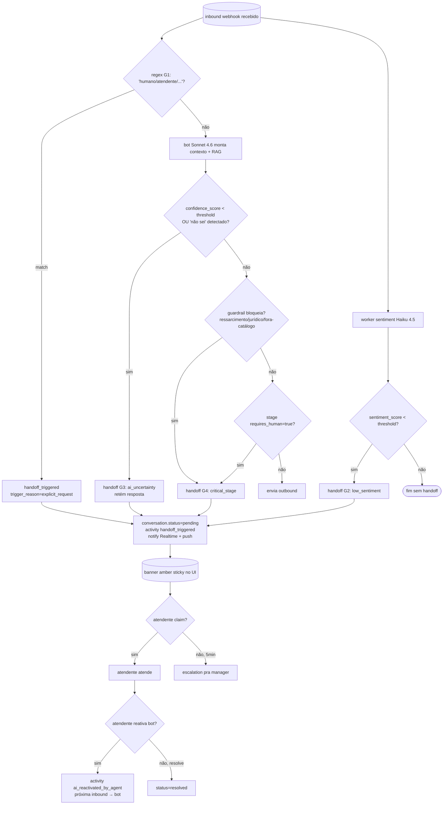
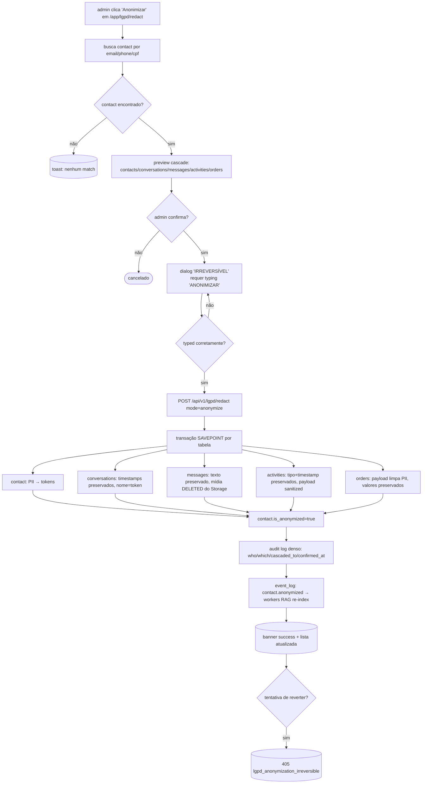
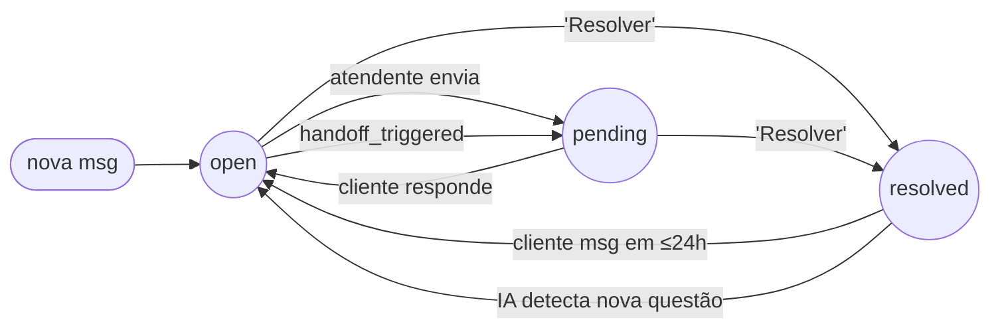

# 04 — Clickflows

> Diagramas Mermaid `flowchart` dos fluxos críticos. Decisões com `{}`, telas/estados com `()`. Cada fluxo cobre caminho feliz + falhas principais.

---

## 4.1 Login → MFA → Onboarding → Inbox

```mermaid
flowchart TD
    A[/login] --> B{credenciais válidas?}
    B -- não --> A1[(error: invalid_credentials)]
    A1 --> A
    B -- sim --> C{MFA habilitado?}
    C -- não & role=admin/super --> D[/onboarding/mfa-setup]
    C -- não & role=agent/viewer --> J{onboarding completo?}
    C -- sim --> E[/login/mfa]
    E --> F{TOTP correto?}
    F -- não --> E1[(error: totp_invalid)]
    F -- recovery_code --> E2{código válido?}
    E2 -- sim --> J
    E2 -- não --> E1
    F -- sim --> J
    D --> D1[escaneia QR + confirma]
    D1 --> D2[mostra recovery codes]
    D2 --> J
    J -- não --> K[/onboarding/welcome]
    K --> K1[/onboarding/connect-whatsapp]
    K1 --> K2[/onboarding/connect-nuvemshop]
    K2 --> K3[/onboarding/configure-ai]
    K3 --> K4[/onboarding/invite-team]
    K4 --> K5[/onboarding/done]
    K5 --> L
    J -- sim & super-admin --> M[/admin/inbox]
    J -- sim & tenant-user --> L[/app/inbox]
```

---

## 4.2 Conversation: receive → claim → reply → resolve

```mermaid
flowchart TD
    W[(webhook WAHA inbound)] --> V{HMAC válido?}
    V -- não --> V1[(401 sem corpo)]
    V -- sim --> L[log raw em webhook_events_log]
    L --> R{idempotência<br/>org+external_id existe?}
    R -- sim --> R1[(200 no-op)]
    R -- não --> P[upsert contact + conversation + message]
    P --> E[emit event_log: whatsapp.message_received]
    E --> N[notify atendentes via Realtime + push]
    N --> U([toast + bell badge])
    U --> C{atendente clica toast?}
    C -- não, IA está ativa --> AI{agent ativo & não force_human?}
    AI -- sim --> AIR[bot responde &lt;3s p95]
    AI -- não --> Q[fica em fila pending]
    C -- sim --> T[/app/inbox/conversationId]
    T --> CL{clica 'Eu cuido'?}
    CL -- 2 simultâneos --> CL1{lock vence?}
    CL1 -- não --> CL2[(409 conversation_already_claimed)]
    CL1 -- sim --> CO[composer focado]
    CL -- sim direto --> CO
    CO --> SE{envia mensagem}
    SE --> OPT[bubble status=sending em &lt;50ms]
    OPT --> WA{WAHA aceita?}
    WA -- erro --> WA1[(status=failed + retry button)]
    WA -- ok --> WA2[status=sent → delivered → read]
    WA2 --> RE{cliente responde?}
    RE -- sim --> RC[bubble inbound + auto-scroll se no fim]
    RC --> SE
    RE -- não, atendente resolve --> RV[clica 'Resolver']
    RV --> RV1{confirma?}
    RV1 -- sim --> RV2[status=resolved + activity logged]
    RV2 --> RV3[(some da fila default + toast)]
    RV3 --> NPS[trigger NPS automático]
```

---

## 4.3 Kanban drag-drop com optimistic UI + rollback

```mermaid
flowchart TD
    A[atendente arrasta KanbanCard] --> B[onDragStart: marca lead state=dragging<br/>ignora broadcast Realtime]
    B --> C[onDragEnd: calcula midpoint(prev,next)]
    C --> D[patch otimista local: card move]
    D --> E[PATCH /api/v1/leads/:id<br/>com stage_id + position_in_stage + updated_at]
    E --> F{response?}
    F -- 200 --> G[reconcilia com payload do server<br/>desmarca dragging]
    F -- 409 conflict --> H[rollback visual + toast 'card mudou']
    H --> H1[refetch lead]
    H1 --> G
    F -- 422 stage_pipeline_mismatch --> I[(rollback + toast erro)]
    F -- network error --> J[retry com backoff 3x]
    J --> J1{recuperou?}
    J1 -- sim --> G
    J1 -- não --> I
    G --> K{stage tem is_won/is_lost?}
    K -- is_won=true --> L[trigger fn_crm_lead_close_on_stage<br/>status=won + closed_at]
    K -- is_lost=true --> L1[obriga lost_reason via dialog]
    K -- não --> M[fim]
    L --> M
    L1 --> M
```

---

## 4.4 Handoff bot → humano (4 gatilhos)



---

## 4.5 LGPD redact com cascade



---

## 4.6 WAHA QR connect

```mermaid
flowchart TD
    A[admin clica 'Conectar número' em /app/integrations/whatsapp/new] --> B[POST /api/v1/channel-sessions<br/>cria row status=STARTING]
    B --> C[backend chama POST /api/sessions na WAHA]
    C --> D{WAHA responde?}
    D -- erro --> D1[(status=FAILED + erro acionável)]
    D -- ok --> E[status=SCAN_QR_CODE em ≤10s]
    E --> F[/app/integrations/whatsapp/sessionId/qr]
    F --> G[frontend faz polling /qr a cada 5s]
    G --> H{QR retornado?}
    H -- não, timeout 60s --> I[auto-refresh QR sem reload]
    I --> G
    H -- sim --> J[exibe QR + countdown 30s]
    J --> K{usuário escaneia?}
    K -- não, expira 60s --> I
    K -- sim --> L[webhook session.status=WORKING chega]
    L --> M[backend extrai phone_number de me.id]
    M --> N[status=WORKING + phone_number salvo]
    N --> O[polling para; UI mostra 'Conectado +5511...']
    O --> P{usuário fecha WhatsApp Web no celular?}
    P -- sim --> P1[webhook session.status=FAILED]
    P1 --> P2[(banner: sessão caiu, escanear de novo)]
    O --> Q{cron sync-sessions detecta divergência?}
    Q -- a cada 1min --> R[sincroniza status DB ↔ WAHA]
```

---

## 4.7 Nuvemshop OAuth + sync inicial

```mermaid
flowchart TD
    A[admin em /app/integrations/nuvemshop] --> B[clica 'Conectar Loja']
    B --> C[redirect → Nuvemshop consent screen<br/>com scopes mínimos]
    C --> D{lojista autoriza?}
    D -- não --> D1[(callback com error)]
    D1 --> A
    D -- sim --> E[callback /integrations/nuvemshop/connect?code=...]
    E --> F[adapter troca code por tokens]
    F --> G{troca ok?}
    G -- não --> G1[(token_invalid + retry button)]
    G -- sim --> H[persiste encrypted-at-rest<br/>NUVEMSHOP_OAUTH_ENCRYPTION_KEY]
    H --> I[healthcheck /store/info]
    I --> J{200?}
    J -- não --> J1[(scopes_insufficient + reconnect)]
    J -- sim --> K[registra 8 webhooks na Nuvemshop]
    K --> L[dispara worker sync inicial]
    L --> M[/app/integrations/nuvemshop/sync com progress bar]
    M --> N{sync completa em background}
    N --> O1[fetch products → KB ingestão]
    N --> O2[fetch customers → contacts + identity resolution]
    O2 --> P{conflito ID?}
    P -- sim --> P1[entra em merge_queue]
    P -- não --> P2[contact criado/reusado]
    N --> O3[fetch orders 90d → crm_leads + activities]
    O1 & P1 & P2 & O3 --> Q[banner success + counters por domínio]
    Q --> R[admin volta pra /app/inbox]
```

---

## 4.8 Conversation status transitions (mini-flowchart)


