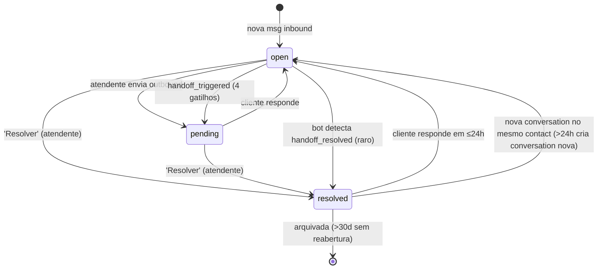
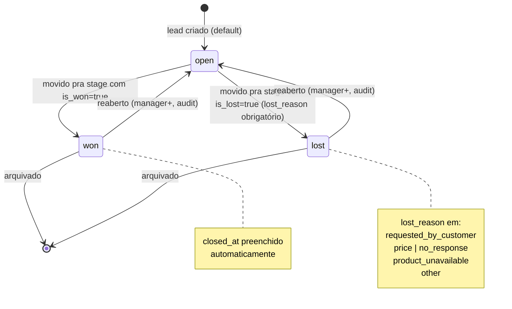
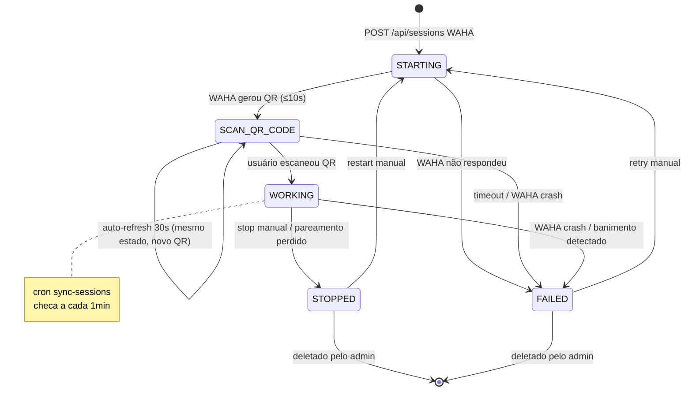
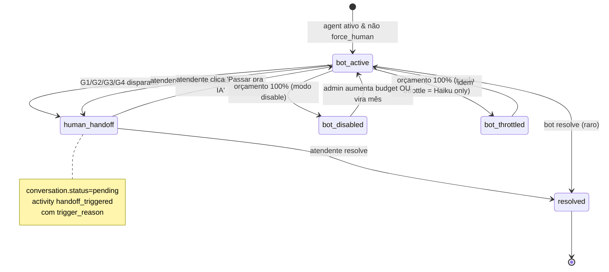
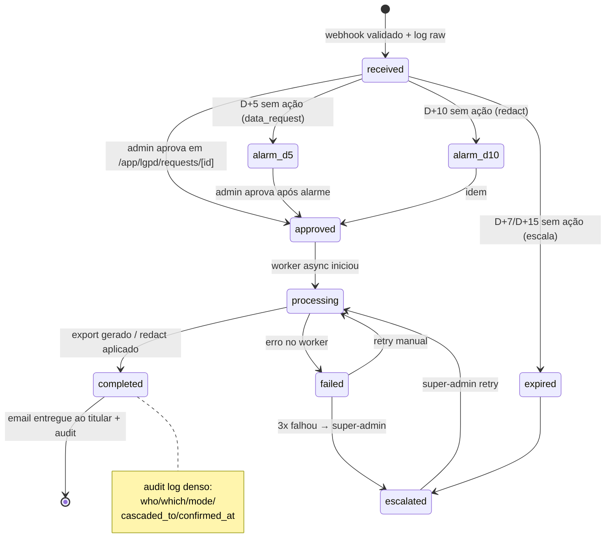
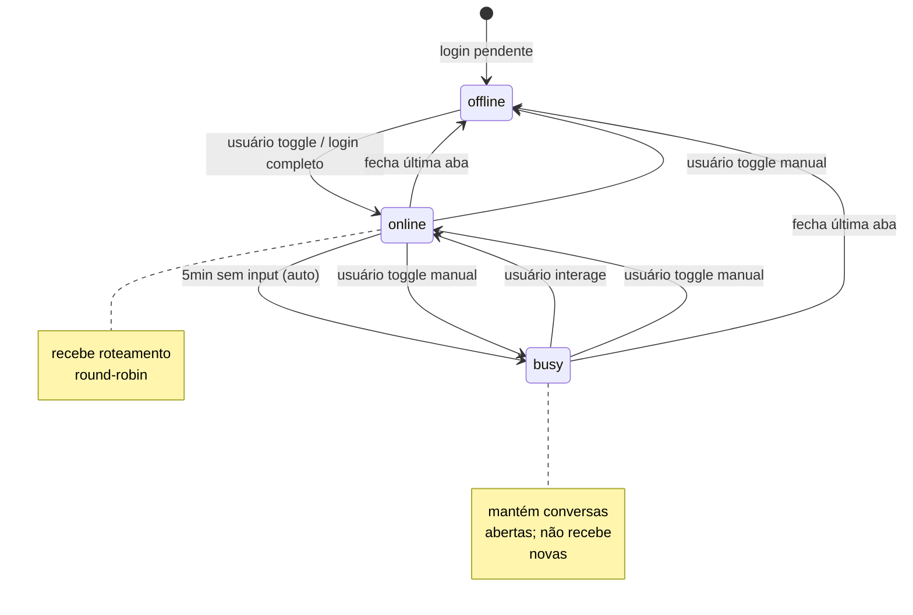
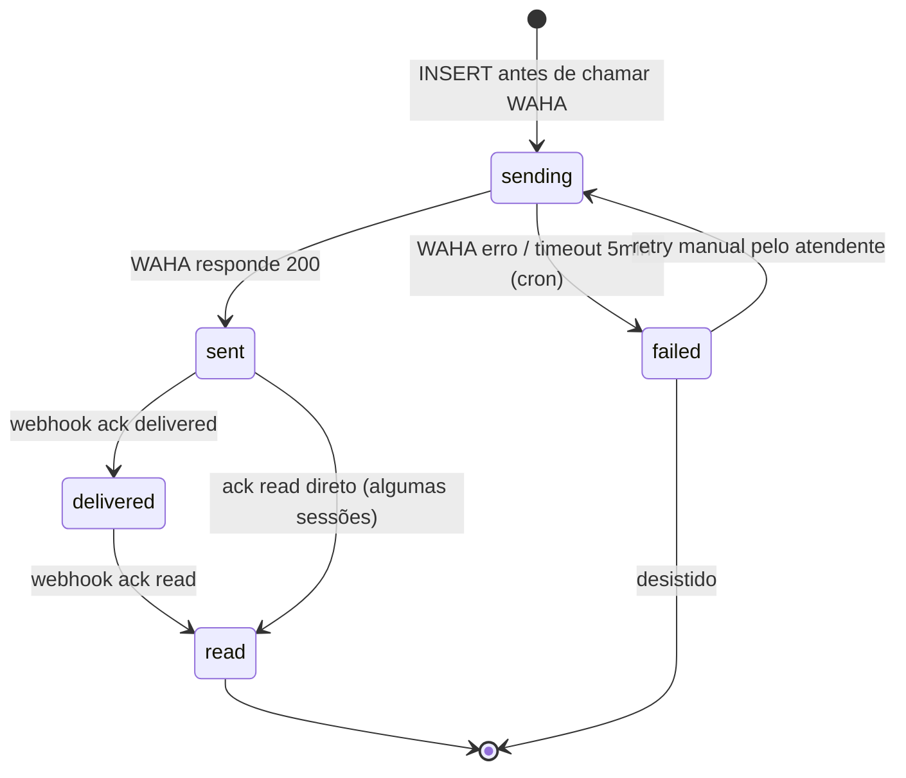
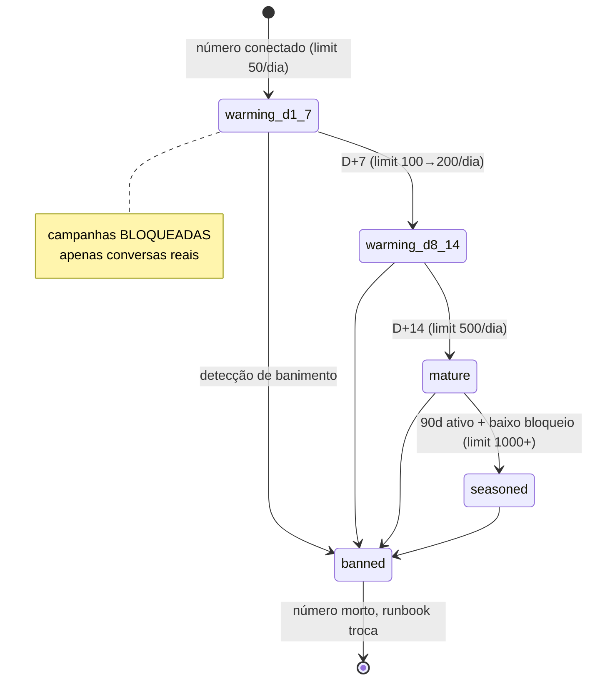
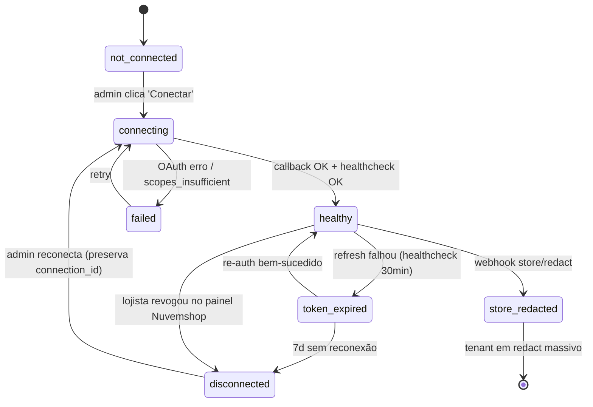

# 05 — State Machines

> Diagramas Mermaid `stateDiagram-v2` das máquinas de estado críticas do produto. Cada uma vira contrato visual entre PRDs e UI.

---

## 5.1 Conversation status

Estados canônicos (Sub-PRD 04 §3.4): `open` (humano/IA ativos OU aguardando 1ª resposta) — `pending` (atendente respondeu, aguardando cliente) — `resolved`.

---

## 5.2 Lead status (open → won/lost via stage flags)

Sub-PRD 02 §3.8. Transição automática via `fn_crm_lead_close_on_stage` quando stage tem `is_won=true` ou `is_lost=true`.

---

## 5.3 Channel session (WAHA)

Sub-PRD 03 §3.1. 1 sessão = 1 número WhatsApp.

---

## 5.4 Bot mode (active → handoff → reactivated)

Sub-PRD 05 §3.7-3.8. Por conversation.

---

## 5.5 LGPD request lifecycle

Sub-PRD 06 §3.9 + Sub-PRD 01 §3.6. SLA D+7 (data_request) / D+15 (redact).

---

## 5.6 Atendente presence

Sub-PRD 04 §3.8. Toggle manual + auto-detect inactivity.

---

## 5.7 Outbound message status

Sub-PRD 03 §3.4. Optimistic UI flow.

---

## 5.8 Channel session warmup (overlay sobre 5.3)

Sub-PRD 03 §3.7. Aplicado a número novo nos primeiros 7–14 dias.

---

## 5.9 Nuvemshop connection

Sub-PRD 06 §3.2-3.3.

