# DeskcommCRM — Diagramas de Arquitetura

Este documento consolida os diagramas canônicos do DeskcommCRM em sintaxe Mermaid. Serve como referência visual única para discussões de arquitetura, onboarding técnico, revisão de PRs estruturais e auditoria LGPD. Os diagramas aderem ao modelo C4 (níveis 1, 2 e 3), complementados por ER, sequência, deployment, fluxo de dados e máquinas de estado. Toda decisão arquitetural representada aqui foi herdada do bundle de referência (`reference-synthesis.md`) ou explicitada nos sub-PRDs `01` a `06`.

---

## 1. C4 Level 1 — System Context

Visão macro do DeskcommCRM como sistema único, mostrando os atores humanos (operadores BPO, lojistas, clientes finais) e os sistemas externos (Nuvemshop, WhatsApp via WAHA, AI Gateway, ANPD). O foco é responder "quem fala com quem" e "qual é a fronteira do produto". O DeskcommCRM concentra a lógica de negócio; tudo que aparece ao redor é dependência ou usuário.

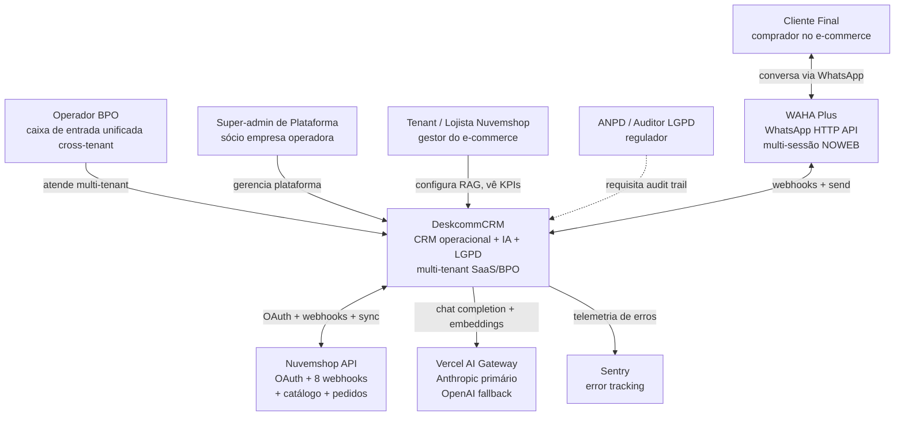

---

## 2. C4 Level 2 — Container Diagram

Decomposição do DeskcommCRM em containers de runtime. O Next.js App é o monolito hospedado na Vercel; Supabase entrega Postgres, Realtime e Storage gerenciados; Upstash provê Redis para rate-limit; WAHA Plus roda em VPS Hostgator próprio (Docker); o MCP server é projeto separado entrando na Fase 2. A linha pontilhada para o MCP marca componentes ainda não construídos no MVP.

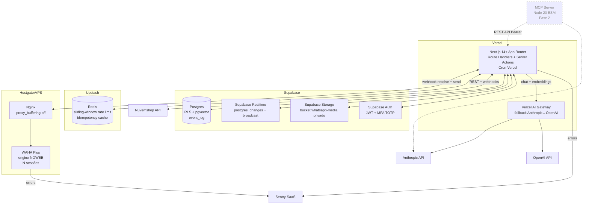

---

## 3. C4 Level 3 — Component (App Backend)

Componentes internos do Next.js App. Camada externa: webhook receivers e API REST canônica. Camada de orquestração: middleware de auth, cron handlers, workers consumindo `event_log`. Camada de acesso: clientes Postgres (RLS-aware via cookie OU admin com filtro manual). Triggers Postgres NUNCA fazem HTTP — apenas escrevem em `event_log`; workers fazem o trabalho assíncrono.

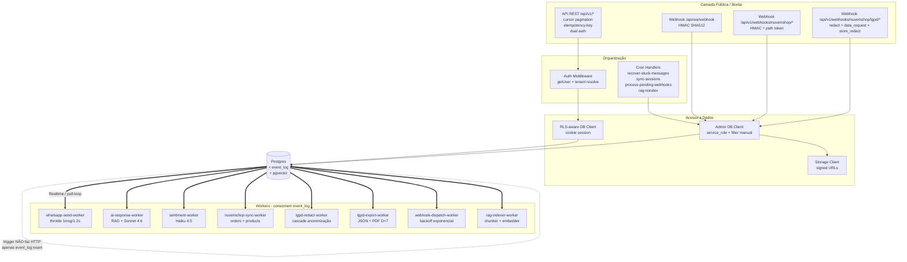

---

## 4. ER Diagram — Schema completo

Schema central do DeskcommCRM. Em torno de `organizations` orbitam três sub-domínios: (a) chat/canal — `channel_sessions`, `contacts`, `conversations`, `messages`; (b) CRM core — `crm_pipelines` → `crm_stages` → `crm_leads` → `crm_lead_activities` (timeline polimórfica) + `crm_lead_links` (vínculos polimórficos); (c) integração e-commerce e LGPD — `tenant_integrations`, `orders`, `nuvemshop_products`. Tabelas de plataforma (`api_tokens`, `event_log`, `webhook_subscriptions`, `usage_events`) servem o monolito inteiro. Multi-tenancy aplicada via `organization_id` em toda tabela tenant-aware.

```mermaid
erDiagram
    organizations ||--o{ user_organizations : has
    organizations ||--o{ channel_sessions : has
    organizations ||--o{ contacts : has
    organizations ||--o{ conversations : has
    organizations ||--o{ messages : has
    organizations ||--o{ crm_pipelines : has
    organizations ||--o{ tenant_integrations : has
    organizations ||--o{ orders : has
    organizations ||--o{ nuvemshop_products : has
    organizations ||--o{ ai_agents : has
    organizations ||--o{ ai_knowledge_sources : has
    organizations ||--o{ api_tokens : has
    organizations ||--o{ webhook_subscriptions : has
    organizations ||--o{ usage_events : has

    user_organizations }o--|| auth_users : "user_id"
    platform_admins }o--|| auth_users : "user_id (cross-tenant)"

    channel_sessions ||--o{ conversations : routes
    contacts ||--o{ conversations : "starts"
    conversations ||--o{ messages : contains
    contacts ||--o{ crm_leads : "linked via lead_links"
    contacts ||--o{ merge_queue : "candidate"

    crm_pipelines ||--o{ crm_stages : has
    crm_stages ||--o{ crm_leads : holds
    crm_leads ||--o{ crm_lead_activities : timeline
    crm_leads ||--o{ crm_lead_links : "polymorphic links"
    orders ||--o{ crm_lead_links : "linked"

    ai_agents ||--o{ ai_invocations : invocations
    ai_knowledge_sources ||--o{ ai_chunks : "chunked + embedded"
    conversations ||--o{ ai_invocations : "context"

    webhook_subscriptions ||--o{ webhook_deliveries : dispatches
    api_tokens ||--o{ api_audit_log : "actor"
    auth_users ||--o{ api_audit_log : "actor"

    organizations ||--o{ event_log : emits
    organizations ||--o{ webhook_events_log : "raw inbound"
    organizations ||--o{ idempotency_keys : "POST dedupe"

    organizations {
        uuid id PK
        text slug UK
        text name
        jsonb settings
        timestamptz created_at
    }
    user_organizations {
        uuid user_id PK_FK
        uuid organization_id PK_FK
        text role "viewer|agent|manager|admin"
    }
    platform_admins {
        uuid user_id PK_FK
        timestamptz granted_at
    }
    contacts {
        uuid id PK
        uuid organization_id FK
        text phone_e164
        text email
        text cpf
        bool is_blocked
        bool is_anonymized
        jsonb custom_fields
    }
    channel_sessions {
        uuid id PK
        uuid organization_id FK
        text waha_session_name
        text status "STARTING|SCAN_QR|WORKING|FAILED|STOPPED"
        text webhook_secret
    }
    conversations {
        uuid id PK
        uuid organization_id FK
        uuid contact_id FK
        uuid channel_session_id FK
        text status "open|pending|resolved"
        uuid assigned_user_id
    }
    messages {
        uuid id PK
        uuid organization_id FK
        uuid conversation_id FK
        text external_id "WAHA id"
        text direction "in|out"
        text status "sending|sent|delivered|read|failed"
        text body
        jsonb media
    }
    webhook_events_log {
        uuid id PK
        uuid organization_id FK
        text provider
        text external_id
        jsonb raw_payload
        timestamptz received_at
    }
    crm_pipelines {
        uuid id PK
        uuid organization_id FK
        text name
        jsonb vocabulary
        jsonb settings "fields schema"
    }
    crm_stages {
        uuid id PK
        uuid pipeline_id FK
        text name
        numeric position
        bool is_won
        bool is_lost
    }
    crm_leads {
        uuid id PK
        uuid organization_id FK
        uuid stage_id FK
        uuid owner_user_id
        numeric position_in_stage
        text status "open|won|lost"
        text lost_reason
        text external_id "Nuvemshop order id"
        jsonb custom_fields
        text[] tags
    }
    crm_lead_activities {
        uuid id PK
        uuid organization_id FK
        uuid lead_id FK
        text type "whatsapp_inbound|stage_changed|handoff_triggered|..."
        text source_module
        uuid source_id
        jsonb metadata
    }
    crm_lead_links {
        uuid id PK
        uuid lead_id FK
        text target_kind "contact|order|conversation|message"
        uuid target_id
        text link_kind
    }
    merge_queue {
        uuid id PK
        uuid organization_id FK
        uuid contact_a FK
        uuid contact_b FK
        text status "pending|merged|rejected"
    }
    ai_agents {
        uuid id PK
        uuid organization_id FK
        text model "anthropic/claude-sonnet-4-6"
        text system_prompt
        jsonb config
    }
    ai_knowledge_sources {
        uuid id PK
        uuid organization_id FK
        text kind "faq|policy_pdf|catalog|resolved_conv"
        text source_uri
    }
    ai_chunks {
        uuid id PK
        uuid source_id FK
        text content
        vector embedding
    }
    ai_invocations {
        uuid id PK
        uuid organization_id FK
        uuid conversation_id FK
        text purpose "chat|sentiment|rag"
        int tokens_in
        int tokens_out
        numeric cost_cents
    }
    tenant_integrations {
        uuid id PK
        uuid organization_id FK
        text provider "nuvemshop"
        jsonb credentials_encrypted
        text status
    }
    orders {
        uuid id PK
        uuid organization_id FK
        text external_id "Nuvemshop order id"
        text status
        int total_cents
        timestamptz placed_at
    }
    nuvemshop_products {
        uuid id PK
        uuid organization_id FK
        text external_id
        text name
        jsonb data
    }
    api_tokens {
        uuid id PK
        uuid organization_id FK
        text token_hash
        text scopes
    }
    api_audit_log {
        uuid id PK
        uuid organization_id FK
        uuid actor_user_id
        text action
        text target_kind
        uuid target_id
        jsonb diff
    }
    event_log {
        uuid id PK
        uuid organization_id FK
        text event_name "lead.created|message.received|..."
        jsonb payload
        timestamptz emitted_at
    }
    idempotency_keys {
        text key PK
        uuid organization_id FK
        jsonb response
        timestamptz expires_at
    }
    webhook_subscriptions {
        uuid id PK
        uuid organization_id FK
        text url
        text secret
        text[] events
    }
    webhook_deliveries {
        uuid id PK
        uuid subscription_id FK
        text status "pending|delivering|success|failed|dead"
        int attempts
        timestamptz next_retry_at
    }
    usage_events {
        uuid id PK
        uuid organization_id FK
        text metric "messages_sent|ai_tokens|storage_mb"
        numeric value
    }
```

---

## 5. Sequence Diagram — Inbound WhatsApp message

Trajeto de uma mensagem que chega do cliente final. WAHA dispara webhook assinado; nosso receiver valida HMAC, persiste o payload bruto em `webhook_events_log` (auditoria), executa identity resolution determinística, faz upsert idempotente em `contacts`, `conversations` e `messages`, emite eventos em `event_log` e responde 200 imediatamente. Workers (sentimento e bot) consomem em paralelo, sem bloquear a resposta.

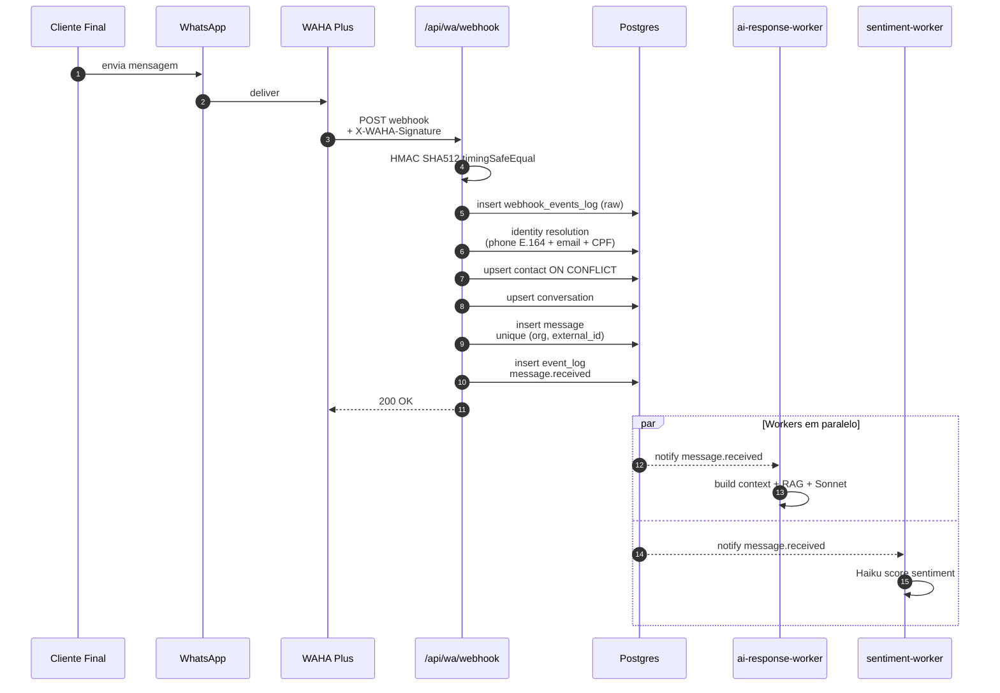

---

## 6. Sequence Diagram — AI bot response with handoff

Pós-evento `message.received`, o `ai-response-worker` constrói contexto (últimas 20 mensagens + perfil do contato + último pedido + RAG hits), chama Sonnet 4.6 via AI Gateway, passa por guardrail (políticas, PII, comprimento). Se gatilho de handoff (cliente pediu humano, sentimento baixo, IA admite incerteza, estágio crítico), registra activity e marca `conversation.status='pending'` notificando atendentes via Realtime. Caso contrário, despacha resposta via WAHA com persistência otimista.

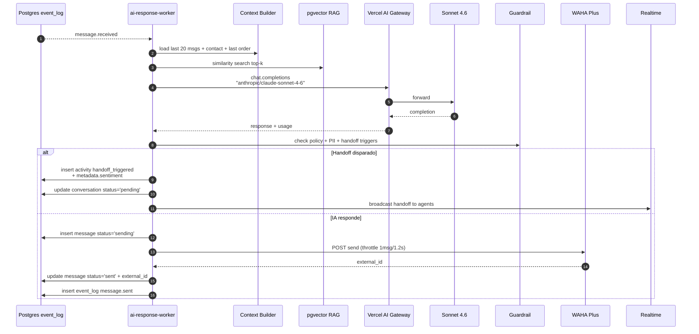

---

## 7. Sequence Diagram — Nuvemshop order/paid webhook

A Nuvemshop assina webhooks por loja. O endpoint resolve o tenant via path token (URL canônica `/api/v1/webhooks/nuvemshop/order-paid/:tenantToken`), valida HMAC, deduplica por `unique (provider, external_id)`, resolve ou cria contato a partir do customer da Nuvemshop, localiza o `crm_lead` por `external_id` e move para o estágio "Pago". Resposta 200 imediata; downstream (notificações, cálculo de KPIs) flui via `event_log`.

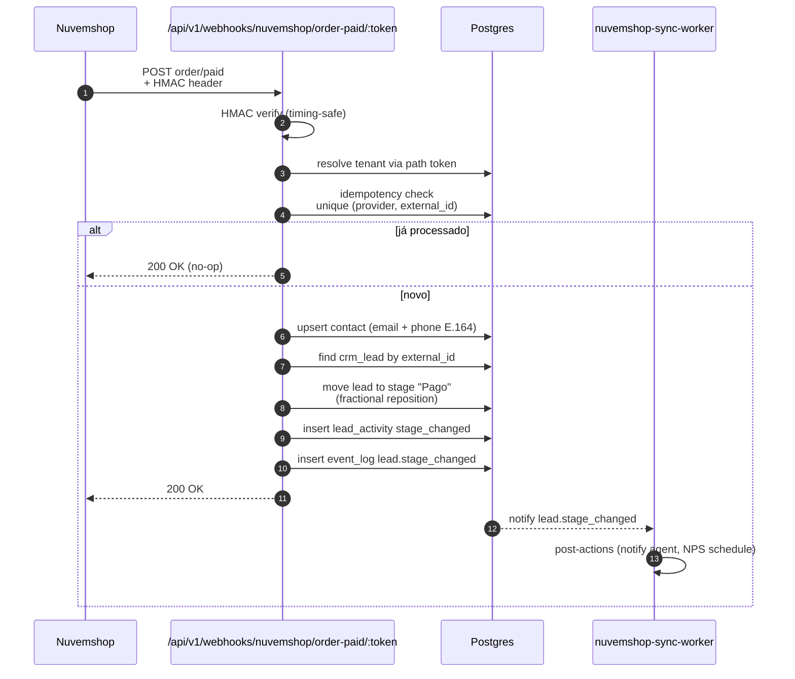

---

## 8. Sequence Diagram — LGPD data_request

Tenant (ou titular via webhook Nuvemshop `customer/data_request`) inicia um pedido de exportação. Endpoint enfileira via `event_log`; `lgpd-export-worker` coleta dados de `contacts`, `crm_leads`, `crm_lead_activities`, `messages`, `orders`; gera JSON estruturado + PDF; sobe pra Storage com URL assinada de TTL curto; notifica titular e tenant; tudo logado em `api_audit_log`. SLA D+7 com alarme em D+5.

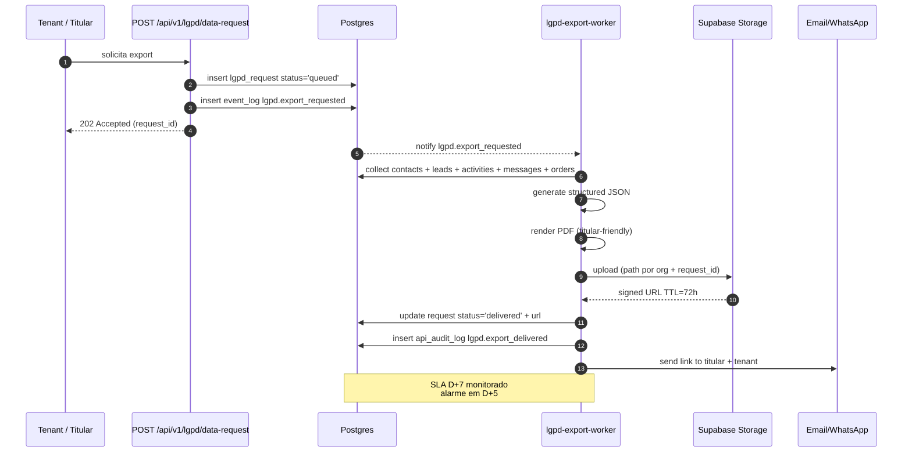

---

## 9. Sequence Diagram — Multi-tenant request flow

Como cada request entra no monolito Next.js e é isolado por tenant. O middleware lê o cookie de sessão Supabase, valida o JWT, resolve o `organization_id` do usuário (ou via super-admin override). A escolha do client Postgres define a postura de segurança: cliente RLS-aware (frontend e endpoints user-facing) ou admin client (webhooks, cron) com filtro manual obrigatório. RLS aplica `fn_user_org_ids()` em toda tabela tenant-aware.

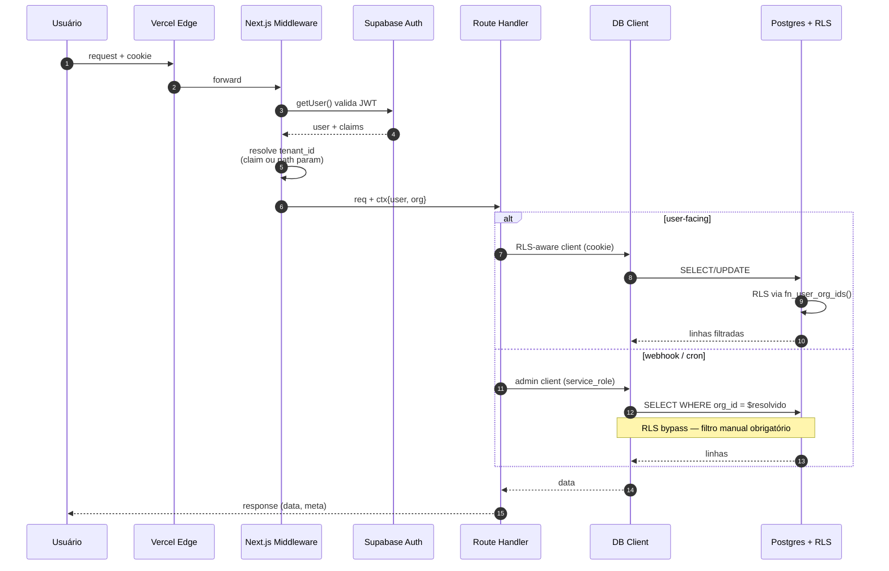

---

## 10. Deployment Diagram

Topologia física de produção. Vercel hospeda o Next.js (Edge + serverless), Supabase entrega os 3 serviços gerenciados, Upstash o Redis, Hostgator VPS roda WAHA atrás de Nginx. AI Gateway é proxy interno da Vercel para Anthropic e OpenAI. Sentry recebe telemetria do Next.js e do host WAHA. Conexões críticas: Realtime via WebSocket persistente, webhooks WAHA via HTTPS, AI calls via HTTPS com observability nativa.

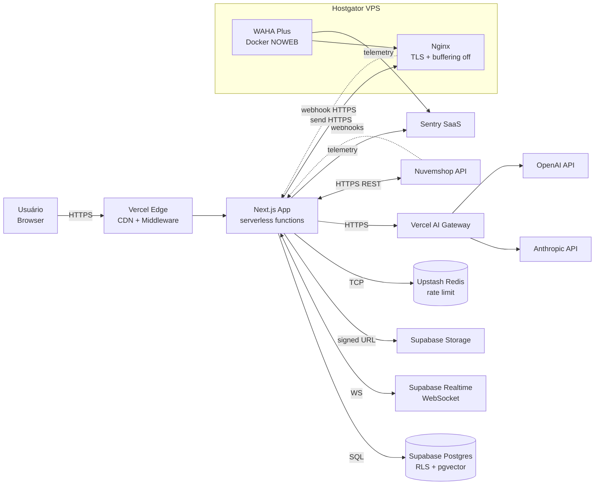

---

## 11. Data Flow — RAG ingestion pipeline

Quatro fontes alimentam a base vetorial por tenant: FAQ (markdown manual), política da loja (PDF), catálogo Nuvemshop (sync periódico), conversas resolvidas (corpus de exemplos). Cada fonte passa pelo chunker (tamanho configurável + overlap), embedder OpenAI (text-embedding-3-small por padrão), grava em `ai_chunks` com `vector` e `source_id`. Re-indexação por cron `rag-reindex` ou trigger ao atualizar fonte. Consumo pelo `ai-response-worker` na busca top-k.

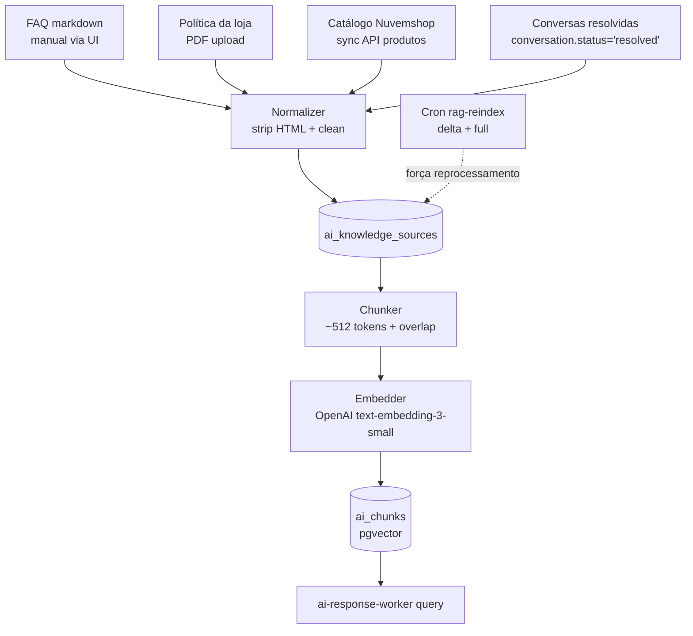

---

## 12. State Machine — Conversation status

Toda conversa transita entre três estados auditáveis. `open` é o estado inicial; transições são registradas como activities. `pending` indica handoff pendente; `resolved` fecha a conversa e dispara NPS automatizado. Reabertura é permitida (cliente volta a falar após `resolved`).

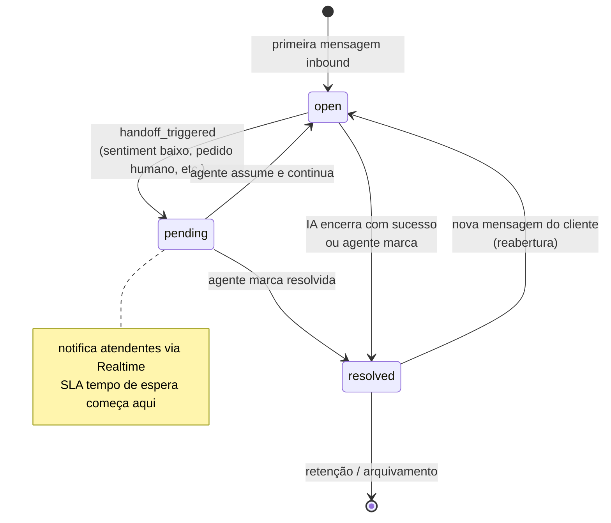

---

## 13. State Machine — Lead status

Lead segue ciclo `open → won|lost`, com possibilidade de reabertura. `won` e `lost` derivam do flag `is_won`/`is_lost` do estágio destino, não de coluna independente. `lost` exige `lost_reason`. Reabertura volta para `open` num estágio explicitamente escolhido.

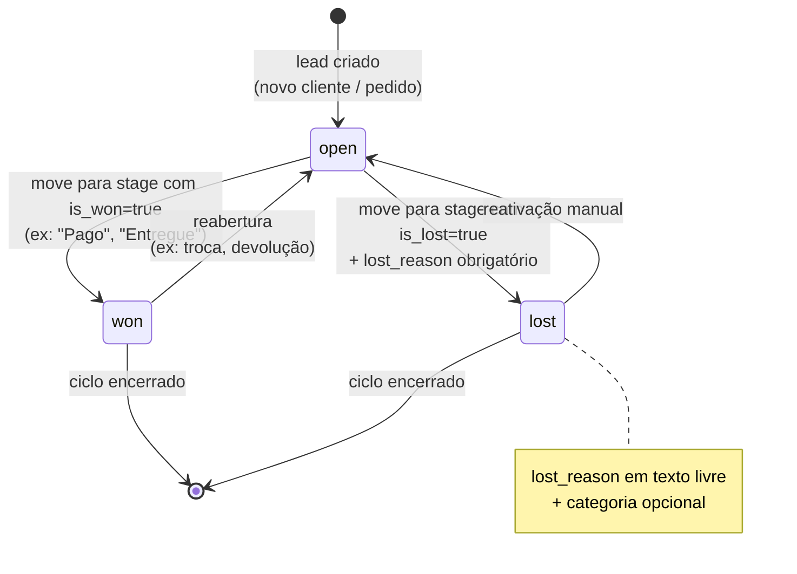

---

## 14. State Machine — Channel session

Estados da sessão WAHA (1 sessão = 1 número). Reflete o ciclo de vida do par WAHA-WhatsApp. `STARTING` → `SCAN_QR_CODE` (UI mostra QR) → `WORKING` (operacional). `FAILED` é absorvente em caso de banimento; `STOPPED` é desligamento controlado. Cron `sync-sessions` reconcilia status com o WAHA periodicamente.

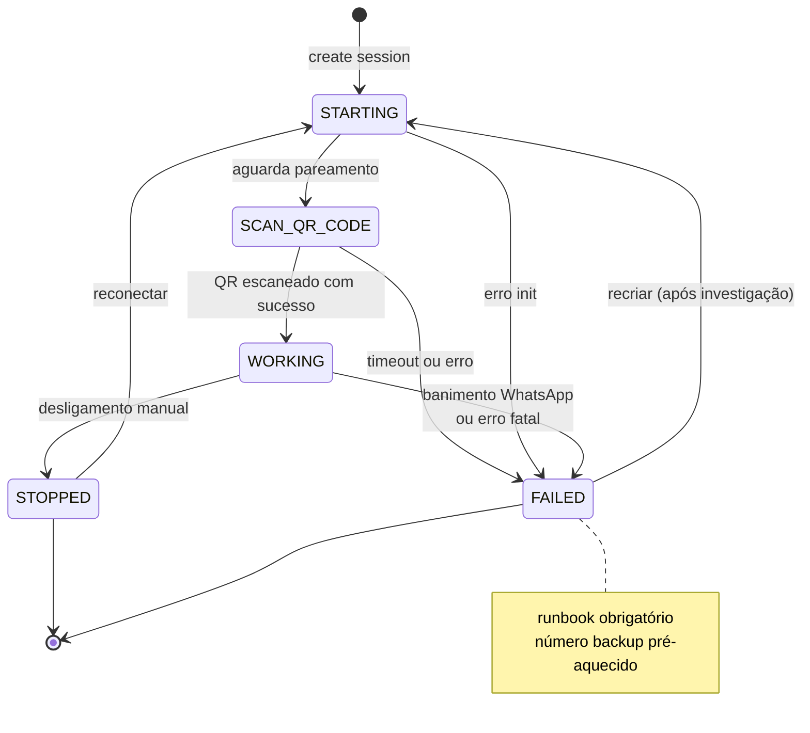

---

## 15. Diagrama de Multi-tenancy

Como o isolamento é garantido em todas as camadas. Toda tabela tenant-aware tem `organization_id uuid not null`. RLS aplica policy idêntica usando `fn_user_org_ids()` (security definer, retorna orgs do usuário). Super-admin ganha um helper que retorna TRUE para qualquer tenant — usado na "caixa de entrada unificada". Service role bypassa RLS, então webhook handlers e cron precisam filtrar manualmente o `organization_id` resolvido a partir de fonte confiável (cookie, JWT claim, webhook secret ou path token), nunca do body.

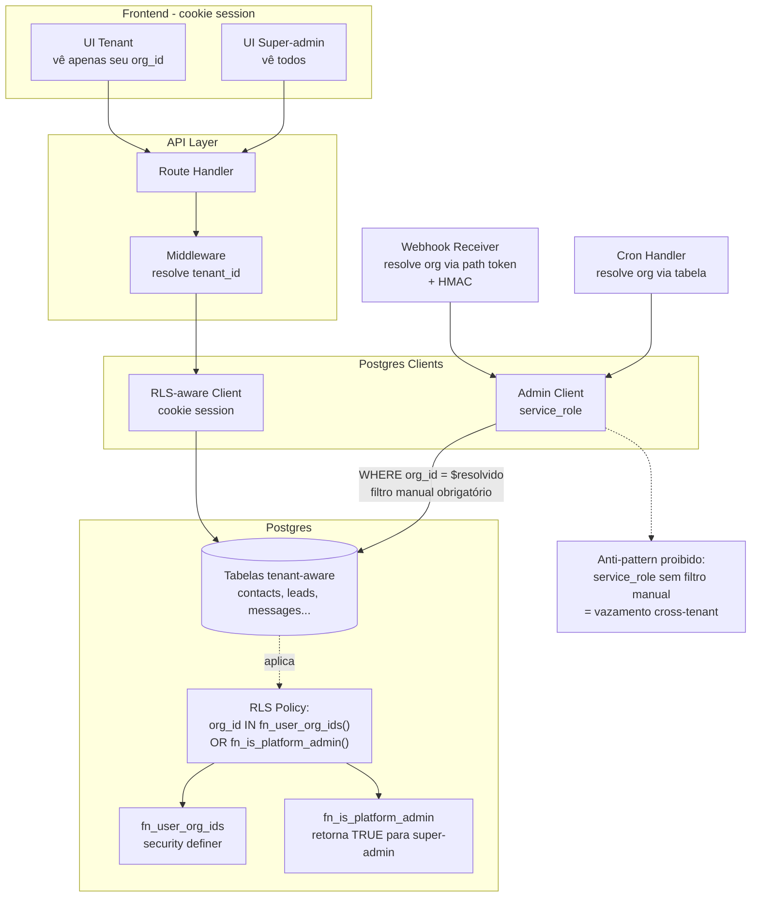

---

## Notas finais

Este documento é vivo. Toda alteração arquitetural relevante (nova tabela tenant-aware, novo worker, novo provider externo, novo estado em máquina) exige atualização correspondente do diagrama afetado e bump da versão no frontmatter. Mantenha a sintaxe Mermaid testada antes de mergear: o GitHub renderiza nativamente; em VS Code use a extensão Mermaid Preview.

Diagramas omissos por estarem fora do escopo do MVP (mas previstos pra documentar quando entrarem):

- MCP Server Component Diagram (Fase 2)
- Sequence de OAuth Nuvemshop (instalação de app)
- Deployment com VTEX/Shopify (Fase 5)
- State machine de webhook_deliveries (pending → delivering → success | failed | dead)
