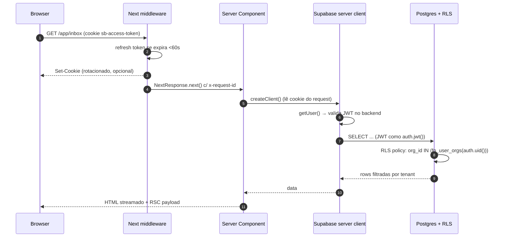
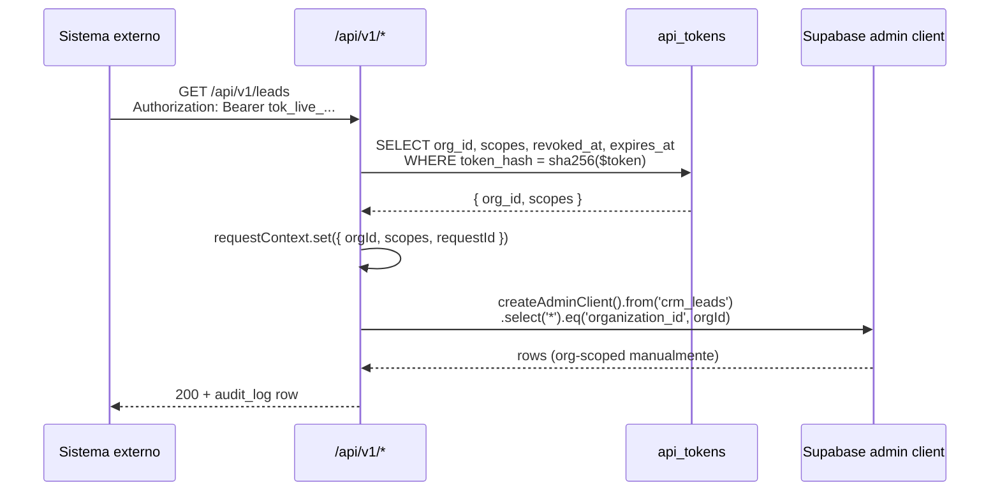
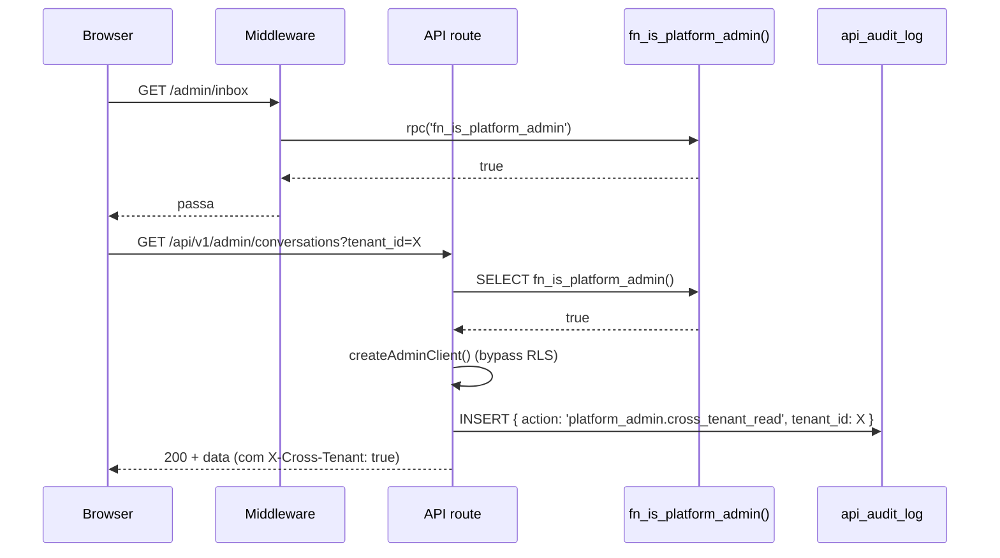
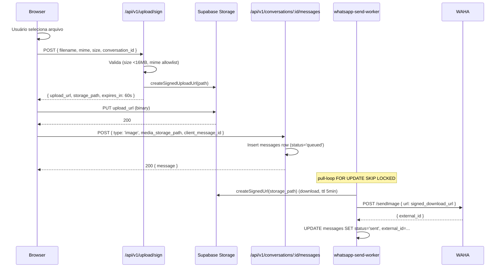

# Spec 09 — Frontend ↔ Backend Integration Contract

> Playbook operacional de comunicação ponta-a-ponta entre o frontend (Next.js 15 App Router) e o backend (Supabase + API Routes + Workers) do DeskcommCRM. Esta spec **fecha decisões** que estavam espalhadas pelas Specs 01–08 e consolida o contrato que todo dev frontend deve consultar **antes de codar qualquer tela**.

---

## 1. Visão Geral & Objetivos

### 1.1 Por que esta spec existe

As Specs 01–08 cobrem schema, RLS, eventos, workers, integrações e deploy. Falta o "como o frontend conversa com tudo isso" num único documento. O resultado é decisão dispersa: dev novo escolhe SWR num lugar, TanStack noutro, chama Supabase direto no client component, esquece `Idempotency-Key`, monta WebSocket próprio, ou escreve tipo a mão quebrando a cadeia gerada do schema.

Esta spec encerra essa dispersão. Cada operação do frontend tem **um caminho canônico** documentado aqui. Se um padrão não estiver aqui, ele não existe — abrir PR pra adicionar antes de usar.

### 1.2 Quem deve ler

- **Todo dev frontend** antes de implementar uma tela do `screen-inventory`.
- **Tech lead / arquiteto** ao revisar PR que toca camada de dados.
- **Dev backend** ao desenhar endpoint novo — pra garantir que o contrato cabe nos hooks deste documento.
- **QA** ao escrever cenários de erro/recuperação.

### 1.3 Princípios não-negociáveis

1. **Type-safe end-to-end.** Tipos fluem do schema Postgres → `lib/database.types.ts` → `lib/types/` → Zod schemas → API routes → hooks → componentes. Romper a cadeia exige ADR.
2. **Auth nunca improvisado.** Cookie de sessão `@supabase/ssr` em fluxo usuário; Bearer token em server-to-server. Não há terceiro caminho.
3. **Idempotência por padrão em mutations.** Toda criação via `apiClient.post` injeta `Idempotency-Key` automaticamente. Toda mutation crítica (send message, claim, move card) usa idempotency key derivada de identidade do payload.
4. **Realtime com cleanup obrigatório.** Toda subscrição passa por `useRealtimeChannel`. `useEffect` cleanup é parte do contrato — não tem "esqueci de fechar canal".
5. **Errors mapeados em playbook único.** A matriz da §8 é a verdade. Um `error.code` desconhecido na UI = bug.

---

## 2. Stack de Comunicação — Decisão Matriz

Esta tabela é a **primeira coisa a consultar** ao começar uma feature.

| Tipo de operação | Mecanismo escolhido | Por quê | Não usar quando |
|---|---|---|---|
| Read inicial de página (RSC) | Server Component + `lib/supabase/server.ts` (`createClient` async) | Streaming SSR, type-safe, RLS aplica via cookie, zero JS no first paint | Operação requer interatividade (filtros que mudam URL não bastam) ou refresh em alta frequência |
| Read interativo (filtros, busca, refetch on-focus) | TanStack Query (`@tanstack/react-query`) + Supabase browser client | Cache compartilhado entre rotas, stale-while-revalidate, optimistic, invalidations cruzadas | A página é puramente RSC e o estado vive na URL |
| Mutation de form simples | Server Action (`'use server'`) | DX limpa, progressive enhancement, `revalidatePath`/`revalidateTag` integrado, sem boilerplate de fetch | Mutation precisa de optimistic UI complexo, retorno parcial streamado, ou roda fora do fluxo de form |
| Mutation com optimistic UI (drag-drop, send message, claim) | TanStack Query `useMutation` + API route `/api/v1/*` via `apiClient` | Controle fino de `onMutate`/`onError`/`onSuccess`, rollback explícito, `Idempotency-Key` automática | A mutation é simples e cabe num form com `useFormState` |
| Mutation server-to-server (webhooks externos chamando back) | API Route com Bearer auth (`Authorization: Bearer tok_...`) | Padrão REST canônico, audit log integrado, isolamento sem cookie | Operação iniciada por um humano logado |
| Realtime updates (inbox, kanban, channel session, presence) | Supabase Realtime via `useRealtimeChannel` hook | Push automático com RLS aplicada nos eventos, escala sem worker próprio | Estado local muda a cada keystroke (use `useState`); mudança não tem mais de 1 observador |
| File upload (mídia WhatsApp, política em PDF) | Direct upload pro Supabase Storage com signed URL | Bypass do servidor pra arquivos grandes, sem ocupar serverless function por minuto | Arquivos <100KB: passar direto via Server Action é mais simples |

### 2.1 Anti-patterns explícitos

- **NÃO** chamar `supabase.from('crm_leads').insert(...)` direto em Client Component pra mutations. Sempre via Server Action ou API route. Justificativa: audit log, idempotência, validação Zod e rate-limit ficam num só lugar.
- **NÃO** consumir `@supabase/supabase-js` cru pra realtime. Sempre via `useRealtimeChannel`. Justificativa: sem cleanup uniforme, a aba acumula canais zumbis após navegação.
- **NÃO** misturar SWR com TanStack Query. Decisão fechada (ADR-01): TanStack Query é o cache layer único.
- **NÃO** criar `useState` global pra dados que vivem em DB. TanStack Query cache é a fonte de verdade no client.
- **NÃO** colocar Bearer token em query string (`?token=...`). API rejeita com `auth_in_query_forbidden` (vide Spec 01 §7.5).
- **NÃO** chamar `supabase.auth.getSession()` em Server Component. Use sempre `getUser()` (valida JWT no backend; vide nota em `lib/supabase/server.ts`).

---

## 3. Auth Propagation — Fluxo Completo

### 3.1 Diagrama sequence — fluxo usuário humano



### 3.2 Middleware — refresh + redirect

```ts
// middleware.ts
import { NextResponse, type NextRequest } from 'next/server';
import { createServerClient } from '@supabase/ssr';

const PUBLIC_PATHS = [/^\/$/, /^\/login(\/.*)?$/, /^\/api\/v1\/webhooks\/.*/, /^\/api\/v1\/health$/];

export async function middleware(req: NextRequest) {
  const requestId = req.headers.get('x-request-id') ?? crypto.randomUUID();
  const res = NextResponse.next({ request: { headers: new Headers(req.headers) } });
  res.headers.set('x-request-id', requestId);

  const isPublic = PUBLIC_PATHS.some((re) => re.test(req.nextUrl.pathname));
  if (isPublic) return res;

  const supabase = createServerClient(
    process.env.NEXT_PUBLIC_SUPABASE_URL!,
    process.env.NEXT_PUBLIC_SUPABASE_ANON_KEY!,
    {
      cookies: {
        getAll: () => req.cookies.getAll(),
        setAll: (cookies) => cookies.forEach(({ name, value, options }) => res.cookies.set(name, value, options)),
      },
    },
  );

  const { data: { user } } = await supabase.auth.getUser();
  if (!user) {
    const url = req.nextUrl.clone();
    url.pathname = '/login';
    url.searchParams.set('next', req.nextUrl.pathname + req.nextUrl.search);
    return NextResponse.redirect(url);
  }

  // Super-admin gating
  if (req.nextUrl.pathname.startsWith('/admin')) {
    const { data: isAdmin } = await supabase.rpc('fn_is_platform_admin');
    if (!isAdmin) {
      const url = req.nextUrl.clone();
      url.pathname = '/403';
      return NextResponse.redirect(url);
    }
  }
  return res;
}

export const config = {
  matcher: ['/((?!_next/static|_next/image|favicon.ico|.*\\.(?:svg|png|jpg|jpeg|gif|webp)$).*)'],
};
```

### 3.3 Server client — leitura de cookie

Já existe em `lib/supabase/server.ts` — usar `createClient()` (async) sempre que estiver dentro de Server Component, Route Handler ou Server Action. Cada chamada cria um cliente novo escopado naquele request — **não cachear globalmente**.

### 3.4 RLS via JWT

O cookie de sessão do Supabase carrega um JWT com `sub = user_id`. Quando o `lib/supabase/server.ts` consulta o Postgres, a função `auth.uid()` retorna esse `sub`. Os helpers canônicos (`fn_user_orgs`, `fn_is_platform_admin`, vide Spec 01 §2.7) usam isso pra cravar o tenant.

> **Regra:** o frontend nunca seleciona `organization_id` manualmente em query. Ele é resolvido pelo Postgres via RLS. Se você está escrevendo `.eq('organization_id', orgId)` no client, está duplicando filtro — checar se a policy não está cobrindo.

### 3.5 Bearer server-to-server



Detalhes: vide Spec 01 §4.4 e §7.5. Pontos críticos pro frontend:
- **Frontend nunca lê Bearer token.** Tokens são server-side only; UI só mostra o token uma vez no `<TokenRevealDialog>` (tela 71) ao criar.
- Revogar token via `POST /api/v1/api-tokens/:id/revoke` — invalida em <1s (cache de 0 segundos no lookup).

### 3.6 Realtime auth

Supabase Realtime usa o mesmo JWT do cookie. Quando o `useRealtimeChannel` chama `supabase.channel(...).subscribe()`, o JWT vai junto via WebSocket; as policies RLS aplicam nos eventos `postgres_changes`, então um tenant nunca recebe payload de outro.

> **Pegadinha:** se o JWT expira durante uma sessão longa (default 1h), o realtime cai silenciosamente. O middleware refresca em request HTTP, mas se o usuário fica numa tela parada, precisa-se chamar `supabase.auth.refreshSession()` periodicamente. O hook `useAuth` (Tier 1) cuida disso com `setInterval(40min)`.

### 3.7 Super-admin path



Toda rota `/admin/*` que cruza tenant **obriga** audit log. Isso é regra de produto, não de auth (vide Spec 01 §6.3).

---

## 4. HTTP Client Wrapper — `lib/api/client.ts`

Wrapper único que toda chamada de API REST do frontend usa. Substitui `fetch` direto.

### 4.1 Tipos

```ts
// lib/api/types.ts
export interface ApiSuccess<T> {
  data: T;
  meta?: {
    cursor?: string | null;
    has_more?: boolean;
    total?: number;
    request_id: string;
  };
}

export interface ApiErrorBody {
  error: {
    code: string;
    message: string;
    details?: Record<string, unknown>;
    request_id: string;
  };
}

export class ApiError extends Error {
  constructor(
    public status: number,
    public code: string,
    public details: Record<string, unknown> | undefined,
    public requestId: string,
    message: string,
  ) {
    super(message);
    this.name = 'ApiError';
  }
}
```

### 4.2 Client

```ts
// lib/api/client.ts
import { v4 as uuid } from 'uuid';
import type { ZodSchema } from 'zod';
import { ApiError, type ApiSuccess, type ApiErrorBody } from './types';

const DEFAULT_TIMEOUT_MS = 10_000;
const RETRYABLE = new Set([429, 503]);

interface RequestOptions<T> {
  schema?: ZodSchema<T>;
  idempotencyKey?: string;
  timeoutMs?: number;
  signal?: AbortSignal;
  headers?: Record<string, string>;
}

async function request<T>(
  method: 'GET' | 'POST' | 'PATCH' | 'DELETE',
  path: string,
  body: unknown | undefined,
  opts: RequestOptions<T> = {},
): Promise<T> {
  const { schema, idempotencyKey, timeoutMs = DEFAULT_TIMEOUT_MS, signal, headers = {} } = opts;
  const requestId = uuid();
  const isMutation = method !== 'GET';

  const finalHeaders: Record<string, string> = {
    'Content-Type': 'application/json',
    'X-Request-Id': requestId,
    ...headers,
  };

  if (isMutation) {
    finalHeaders['Idempotency-Key'] = idempotencyKey ?? uuid();
  }

  const ctrl = new AbortController();
  const timeoutId = setTimeout(() => ctrl.abort(new Error('timeout')), timeoutMs);
  signal?.addEventListener('abort', () => ctrl.abort(signal.reason));

  let attempt = 0;
  const maxAttempts = 3;

  try {
    while (true) {
      attempt++;
      const res = await fetch(path, {
        method,
        headers: finalHeaders,
        body: body !== undefined ? JSON.stringify(body) : undefined,
        signal: ctrl.signal,
        credentials: 'same-origin',
      });

      // Retry exponencial pra 429 e 503
      if (RETRYABLE.has(res.status) && attempt < maxAttempts) {
        const retryAfter = Number(res.headers.get('retry-after'));
        const base = 200 * 2 ** (attempt - 1); // 200, 400, 800
        const jitter = Math.random() * 100;
        const delay = retryAfter > 0 ? retryAfter * 1000 : base + jitter;
        await new Promise((r) => setTimeout(r, delay));
        continue;
      }

      const json = (await res.json().catch(() => ({}))) as ApiSuccess<T> | ApiErrorBody;

      if (!res.ok) {
        const err = (json as ApiErrorBody).error;
        throw new ApiError(
          res.status,
          err?.code ?? 'unknown',
          err?.details,
          err?.request_id ?? requestId,
          err?.message ?? `HTTP ${res.status}`,
        );
      }

      const data = (json as ApiSuccess<T>).data;
      if (schema) return schema.parse(data);
      return data;
    }
  } finally {
    clearTimeout(timeoutId);
  }
}

export const apiClient = {
  get:    <T>(path: string, opts?: RequestOptions<T>) => request<T>('GET', path, undefined, opts),
  post:   <T>(path: string, body: unknown, opts?: RequestOptions<T>) => request<T>('POST', path, body, opts),
  patch:  <T>(path: string, body: unknown, opts?: RequestOptions<T>) => request<T>('PATCH', path, body, opts),
  delete: <T>(path: string, opts?: RequestOptions<T>) => request<T>('DELETE', path, undefined, opts),
};
```

### 4.3 Uso real

```ts
const lead = await apiClient.post<Lead>(
  '/api/v1/leads',
  { pipeline_id: 'uuid', title: 'Novo cliente' },
  {
    schema: leadSchema,                      // valida response runtime
    idempotencyKey: `lead-from-conv-${convId}`, // override pro caso de auto-criação a partir de conversa
  },
);
```

### 4.4 Notas de design

- **Cookies vão automaticamente** via `credentials: 'same-origin'` — não precisa hook injetando.
- **Retry só pra 429 e 503.** 4xx/5xx fora desses dois sobem como `ApiError` direto. Razão: idempotência tá garantida server-side; retry de 500 pode disparar side-effect duplo se a transação tiver passado em parte.
- **Timeout default 10s.** Override pra uploads (60s) ou cron debug (30s).
- **Zod opcional**, mas obrigatório no boundary de feature P0 (vide ADR-03).

---

## 5. Type Safety Boundary

A cadeia tem 6 elos. Romper qualquer um exige justificativa em PR.

### 5.1 Cadeia

1. **DB schema** → migrations SQL (Spec 01 §2, Spec 02 §2, Spec 03 §3, etc).
2. **Generated types** → `lib/database.types.ts` (regenerado via `pnpm gen:types` após cada migration; ~2184 linhas hoje).
3. **Domain aliases** → `lib/types/<entity>.ts` com aliases enxutos.
4. **Zod schemas** → `lib/schemas/<entity>.ts` com 1 schema por entidade pro boundary das API routes.
5. **API contracts** → cada API route exporta `request` e `response` types.
6. **Frontend hooks** → consomem os types via TanStack Query generics.

### 5.2 Exemplo — Lead

```ts
// lib/types/leads.ts
import type { Database } from '@/lib/database.types';
export type Lead = Database['public']['Tables']['crm_leads']['Row'];
export type LeadInsert = Database['public']['Tables']['crm_leads']['Insert'];
export type LeadUpdate = Database['public']['Tables']['crm_leads']['Update'];
export type LeadStatus = Lead['status']; // 'open' | 'won' | 'lost' | 'archived'

// lib/schemas/leads.ts
import { z } from 'zod';
export const createLeadSchema = z.object({
  pipeline_id: z.string().uuid(),
  title: z.string().min(1).max(200),
  contact_id: z.string().uuid().optional(),
  stage_id: z.string().uuid().optional(),
  value_cents: z.number().int().nonnegative().optional(),
  custom_fields: z.record(z.string(), z.unknown()).default({}),
});
export type CreateLeadInput = z.infer<typeof createLeadSchema>;

export const moveLeadSchema = z.object({
  stage_id: z.string().uuid(),
  position_in_stage: z.number(),
  expected_updated_at: z.string().datetime(), // optimistic concurrency
});
export type MoveLeadInput = z.infer<typeof moveLeadSchema>;

// app/api/v1/leads/route.ts
import { createLeadSchema } from '@/lib/schemas/leads';
import { jsonOk, jsonError } from '@/lib/api/wrapper';
export async function POST(req: Request) {
  const parsed = createLeadSchema.safeParse(await req.json());
  if (!parsed.success) return jsonError(422, 'validation_error', parsed.error.flatten());
  // ... insert
  return jsonOk(lead);
}

// hooks/data/useCreateLead.ts
import { useMutation } from '@tanstack/react-query';
import { apiClient } from '@/lib/api/client';
import { type Lead } from '@/lib/types/leads';
import { type CreateLeadInput } from '@/lib/schemas/leads';
import { ApiError } from '@/lib/api/types';

export function useCreateLead() {
  return useMutation<Lead, ApiError, CreateLeadInput>({
    mutationFn: (input) => apiClient.post<Lead>('/api/v1/leads', input),
  });
}
```

### 5.3 Regra de ouro

> Um arquivo TS no frontend que importa de `@supabase/supabase-js` cru sem passar por `lib/types/` ou `lib/schemas/` é code smell. Code review deve barrar.

---

## 6. Realtime Channel Registry

Tabela canônica de **todos** os canais Supabase Realtime usados no app. Adicionar canal novo = adicionar linha aqui.

| Tela | Canal | Tabela observada / mecanismo | Filtro | Hook | Cleanup |
|---|---|---|---|---|---|
| `/app/inbox` | `org-{org_id}-conversations` | `conversations` | `org_id=eq.{org_id}` | `useConversationsRealtime(orgId, filter)` | useEffect cleanup → `supabase.removeChannel()` |
| `/app/inbox/[id]` | `conv-{conv_id}-messages` | `messages` | `conversation_id=eq.{conv_id}` | `useMessagesRealtime(convId)` | id muda OU unmount |
| `/app/inbox/[id]` | `conv-{conv_id}-typing` | broadcast | n/a | `useTypingIndicator(convId, userId)` | unmount + clearTimeouts |
| `/app/pipelines/[id]` | `pipeline-{pipeline_id}-leads` | `crm_leads` | `pipeline_id=eq.{pipeline_id}` | `useBoard(pipelineId, filters)` | unmount |
| Layout autenticado | `org-{org_id}-presence` | broadcast/presence | n/a | `usePresence(orgId)` | logout / org switch |
| `/admin/inbox` | `admin-conversations-{platform_admin_id}` | `conversations` (cross-tenant via SECURITY DEFINER view) | n/a | `useAdminInboxRealtime(filters)` | unmount |
| `/app/integrations/whatsapp` | `org-{org_id}-channel-sessions` | `channel_sessions` | `org_id=eq.{org_id}` | `useChannelSessions(orgId)` | unmount |
| `/app/integrations/whatsapp/[id]/qr` | `org-{org_id}-channel-session-qr` | `channel_sessions` | `id=eq.{id}` | `useQRPolling(sessionId)` | qr scaneado / unmount |
| `/app/contacts/[id]/timeline` | `contact-{contact_id}-activities` | `crm_lead_activities` | `contact_id=eq.{contact_id}` | `useTimelineRealtime(contactId)` | unmount |
| `/app/integrations/nuvemshop/sync` | `org-{org_id}-sync-progress` | broadcast | n/a | `useSyncProgress(orgId)` | sync completou / unmount |
| `/app/ai/usage` | `org-{org_id}-ai-invocations` | `ai_invocations` | `org_id=eq.{org_id}` | `useAIUsageRealtime(orgId)` | unmount |
| `/admin/dashboard` | `platform-alerts` | broadcast | n/a | `useAdminAlerts()` | unmount |
| `/admin/tenants/[id]/health` | `tenant-{id}-health` | broadcast | n/a | `useTenantHealthRealtime(id)` | unmount |
| `/admin/incidents` | `platform-incidents` | `incidents` | n/a (cross-tenant via fn) | `useIncidentsRealtime()` | unmount |
| `/app/lgpd/requests` | `org-{org_id}-lgpd` | `lgpd_requests` | `org_id=eq.{org_id}` | `useLGPDRequestsRealtime(orgId)` | unmount |
| `/app/contacts/merge-queue` | `org-{org_id}-merge-queue` | `merge_queue` | `org_id=eq.{org_id}` | `useMergeQueueRealtime(orgId)` | unmount |
| `/app/ai/knowledge/sources` | `org-{org_id}-rag-status` | `ai_knowledge_sources` | `org_id=eq.{org_id}` | `useRAGSourcesRealtime(orgId)` | unmount |

### 6.1 Comportamento canônico por evento

| Evento recebido | Ação default |
|---|---|
| `INSERT` | Patch in-place via `qc.setQueryData` (prepend ou append conforme order); evita refetch |
| `UPDATE` | Match por `id`; substitui row no cache. Se `id` está no `draggingRef` (kanban) ou em otimismo pendente, **ignora** |
| `DELETE` | Remove do cache; se a tela de detalhe está aberta na row deletada, redirect → list com toast "Item removido" |

Para casos onde a payload não basta (joins agregados): chamar `qc.invalidateQueries({ queryKey: [...] })` no callback. Esse é o fallback, não o default.

### 6.2 Reconexão / canal caído

`useRealtimeChannel` expõe `status`. Provider raiz (`<RealtimeHealthProvider>`) agrega todos os canais e renderiza `<OfflineBanner>` quando 1+ canal está em `channel_error` ou `timed_out` por >30s.

```tsx
// app/(authenticated)/layout.tsx
<RealtimeHealthProvider>
  {children}
  <OfflineBanner />
</RealtimeHealthProvider>
```

`<OfflineBanner>` (vide §8) mostra "Sistema instável. Tentando reconectar...". Após reconexão bem-sucedida, **invalida todas as queries-chave** (`conversations`, `messages`, `board`) pra recompor estado que pode ter divergido.

### 6.3 Hook primitivo

`useRealtimeChannel` está definido em `Spec 04 §4.1` — código completo lá. Esta spec apenas lista os canais que devem chamá-lo. **Não duplicar.**

---

## 7. Optimistic Mutation Patterns

Três patterns canônicos. Toda mutation otimista no app cai num desses; se não cai, abrir ADR.

### 7.1 Pattern A — Send message (insert otimista com dedup)

Usado em: `useSendMessage`. Spec 04 §7.1 tem o código completo. Resumo do contrato:

1. Cliente gera `client_message_id` (UUID v4).
2. `onMutate`: insere row otimista em `qc.setQueryData(['messages', convId], ...)` com `id: 'optimistic-{cmid}'` e `status: 'sending'`.
3. `mutationFn`: `apiClient.post('/api/v1/conversations/:id/messages', { ..., client_message_id }, { idempotencyKey: cmid })`.
4. `onSuccess`: substitui row otimista pela response real.
5. `onError`: marca status `failed`, mostra `toast.error("Falha ao enviar. Toque na bolha pra reenviar.")`.
6. **Realtime INSERT** vindo de `useMessagesRealtime` deduplica por `client_message_id` — vide Spec 04 §4.2.

> **Idempotency-Key = `client_message_id`.** Garante que retry após timeout não duplica mensagem no DB nem no WhatsApp (server faz lookup em `idempotency_keys` antes de inserir).

### 7.2 Pattern B — Drag card no kanban (update com OCC)

```ts
// hooks/data/useMoveCard.ts
import { useMutation, useQueryClient } from '@tanstack/react-query';
import { apiClient } from '@/lib/api/client';
import type { Lead } from '@/lib/types/leads';
import type { MoveLeadInput } from '@/lib/schemas/leads';
import { ApiError } from '@/lib/api/types';

interface MoveVars {
  leadId: string;
  toStageId: string;
  toIndex: number;
  expectedUpdatedAt: string;
}

export function useMoveCard(pipelineId: string) {
  const qc = useQueryClient();
  const boardKey = ['board', pipelineId] as const;

  return useMutation<Lead, ApiError, MoveVars, { snapshot: Lead[] | undefined }>({
    mutationFn: ({ leadId, toStageId, toIndex, expectedUpdatedAt }) => {
      const position = computeMidpoint(qc, pipelineId, toStageId, toIndex);
      return apiClient.post<Lead>(
        `/api/v1/leads/${leadId}/move`,
        { stage_id: toStageId, position_in_stage: position, expected_updated_at: expectedUpdatedAt } satisfies MoveLeadInput,
        { idempotencyKey: `move-${leadId}-${expectedUpdatedAt}` },
      );
    },
    onMutate: async (vars) => {
      await qc.cancelQueries({ queryKey: boardKey });
      const snapshot = qc.getQueryData<Lead[]>(boardKey);
      qc.setQueryData<Lead[]>(boardKey, (prev) =>
        (prev ?? []).map((l) =>
          l.id === vars.leadId
            ? { ...l, stage_id: vars.toStageId, position_in_stage: computeMidpoint(qc, pipelineId, vars.toStageId, vars.toIndex) }
            : l,
        ),
      );
      return { snapshot };
    },
    onError: (err, _vars, ctx) => {
      qc.setQueryData(boardKey, ctx?.snapshot);
      if (err instanceof ApiError && err.status === 409) {
        toast.error(`Card movido por outro atendente. Atualizando…`);
        qc.invalidateQueries({ queryKey: boardKey });
      } else {
        toast.error('Falha ao mover. Tente de novo.');
      }
    },
    onSuccess: (server) => {
      qc.setQueryData<Lead[]>(boardKey, (prev) =>
        (prev ?? []).map((l) => (l.id === server.id ? server : l)),
      );
    },
  });
}
```

Pontos:
- **`expected_updated_at`** habilita Optimistic Concurrency Control no server: `UPDATE ... WHERE id=$1 AND updated_at = $expected`. Se 0 rows, retorna 409.
- Realtime UPDATE chega: `useBoard` ignora se `id` está em `draggingRef` (Spec 04 §4.4) — evita "salto" durante drag.
- Idempotency-Key = `move-{leadId}-{expectedUpdatedAt}` — retry exato é safe.

### 7.3 Pattern C — Claim conversation (atomic write com race protection)

```ts
// hooks/data/useClaimConversation.ts
export function useClaimConversation(conversationId: string) {
  const qc = useQueryClient();
  return useMutation<Conversation, ApiError, void>({
    mutationFn: () =>
      apiClient.post<Conversation>(
        `/api/v1/conversations/${conversationId}/claim`,
        {},
        { idempotencyKey: `claim-${conversationId}` },
      ),
    onSuccess: (server) => {
      qc.setQueryData(['conversation', conversationId], server);
      toast.success('Você assumiu esta conversa.');
    },
    onError: (err) => {
      if (err instanceof ApiError && err.code === 'conversation_already_claimed') {
        const who = err.details?.assigned_to_name as string | undefined;
        toast.error(`Outro atendente já assumiu${who ? ` (${who})` : ''}.`);
        qc.invalidateQueries({ queryKey: ['conversation', conversationId] });
      } else {
        toast.error('Erro ao assumir. Tente de novo.');
      }
    },
  });
}
```

Server-side é `UPDATE ... WHERE assigned_to_user_id IS NULL` (Spec 04 §9.2). 0 rows → 409 `conversation_already_claimed` com `details.assigned_to_name`. **Sem optimistic update** porque o vencedor da corrida tem que vir do server.

---

## 8. Error → UI Playbook

Matriz definitiva. Toda toast/banner/redirect que renderiza por causa de `ApiError` tem que cair numa linha desta tabela. Adicionar caso novo → PR aqui antes de implementar UI.

| HTTP | error.code | UI behavior | Component | Copy PT-BR |
|---|---|---|---|---|
| 400 | `body_malformed` | Toast destructive | `<ApiErrorToast>` | "Requisição inválida. Recarregue a página." |
| 400 | `cursor_malformed` / `cursor_invalid_signature` / `cursor_tenant_mismatch` | Reset paginação + toast warning | `<ApiErrorToast>` | "Lista atualizada. Voltando ao início." |
| 401 | `auth_required` / `unauthenticated` | Redirect → `/login?next=...` | Middleware + `<ApiErrorBoundary>` | "Sua sessão expirou. Entre novamente." |
| 401 | `token_invalid` / `token_revoked` | Redirect → `/login` | Middleware | "Acesso revogado." |
| 401 | `mfa_required` | Redirect → `/login/mfa` | Middleware | "Verificação MFA necessária." |
| 401 | `mfa_invalid` | Inline error | `<TOTPInput error>` | "Código inválido. Tente de novo." |
| 403 | `mfa_enrollment_required` | Redirect → `/onboarding/mfa-setup` | Middleware | "Configure MFA para continuar." |
| 403 | `forbidden_role` | Permission-denied page (403) | `<PermissionDenied>` | "Você não tem permissão pra essa ação." |
| 403 | `lgpd_anonymization_irreversible` | Toast destructive + bloqueio campo | `toast.error()` | "Anonimização não pode ser revertida (LGPD)." |
| 404 | `tenant_not_found` | Redirect → `/app` + toast | `<ApiErrorToast>` | "Workspace não encontrado." |
| 404 | `resource_not_found` | Empty state inline | `<EmptyState variant="not-found">` | "Não encontramos o que você procurava." |
| 409 | `idempotency_conflict` | Toast destructive | `<ApiErrorToast>` | "Operação duplicada com dados diferentes. Recarregue." |
| 409 | `tenant_already_exists` | Inline form error | FormField error | "Este CNPJ já tem cadastro." |
| 409 | `conversation_already_claimed` | Toast informativo + invalidate | `<ApiErrorToast>` | "Outro atendente já assumiu." |
| 409 | `lgpd_in_progress` | Toast warning | `toast.warning()` | "Outra solicitação já está em curso. Aguarde." |
| 422 | `validation_error` | Inline form errors via `error.details.fieldErrors` | `<FormField error>` | "Verifique os campos destacados." |
| 422 | `lost_reason_required` | Inline form error | FormField error | "Selecione um motivo pra fechar." |
| 422 | `phone_must_be_e164` | Inline form error | FormField error | "Telefone no formato +5511999998888." |
| 429 | `rate_limited` | Toast warning + auto-retry (já no client) | `toast.warning()` | "Muitas requisições. Tentando de novo em {retry_after}s..." |
| 500 | `internal_error` ou `unknown` | Error boundary | `<ErrorBoundary>` | "Algo quebrou aqui. Estamos vendo. ID: {requestId}" |
| 503 | qualquer | Toast + offline banner | `<OfflineBanner>` | "Sistema instável. Tentando reconectar..." |

### 8.1 Wrapper de toast

```tsx
// components/feedback/ApiErrorToast.tsx
'use client';
import { toast } from 'sonner';
import { ApiError } from '@/lib/api/types';

const COPY: Record<string, { variant: 'error' | 'warning'; msg: string }> = {
  body_malformed: { variant: 'error', msg: 'Requisição inválida. Recarregue a página.' },
  conversation_already_claimed: { variant: 'error', msg: 'Outro atendente já assumiu.' },
  lgpd_anonymization_irreversible: { variant: 'error', msg: 'Anonimização não pode ser revertida (LGPD).' },
  rate_limited: { variant: 'warning', msg: 'Muitas requisições. Tentando de novo…' },
  // ... resto
};

export function showApiError(err: unknown) {
  if (err instanceof ApiError) {
    const entry = COPY[err.code];
    if (entry) {
      toast[entry.variant](entry.msg, { description: `ID: ${err.requestId}` });
      return;
    }
    toast.error(err.message, { description: `ID: ${err.requestId}` });
    return;
  }
  toast.error('Erro inesperado. Tente novamente.');
}
```

Hook `useApiErrorHandler()` retorna `showApiError` já bound; usar em `onError` de mutations não-otimistas (otimistas já têm tratamento custom como em §7).

---

## 9. Per-Screen Contract — 25 telas P0 do MVP

Tabela exaustiva pra cada tela P0. Use isso como checklist antes de codar.

| Rota | Layout | Queries (TanStack/RSC) | Mutations | Subscriptions | Eventos emitidos | Shortcuts |
|---|---|---|---|---|---|---|
| `/login` | public | `auth.signInWithPassword()` (Supabase direto) | n/a | n/a | `auth.login_success` / `auth.login_failed` | Enter submit, Tab navega |
| `/login/mfa` | public | `auth.mfa.challenge()` | `auth.mfa.verify()` | n/a | `auth.mfa_verified` / `auth.mfa_failed` | Enter submit |
| `/login/recovery` | public | n/a | `auth.recovery.consume()` | n/a | `auth.recovery_used` | Enter submit |
| `/onboarding/welcome` | onboarding | RSC: `getUser()`, `getInvite()` | `acceptInvite(token)` (Server Action), `setPassword()` | n/a | `member.invite_accepted` | n/a |
| `/onboarding/mfa-setup` | onboarding | `auth.mfa.enroll()` | `auth.mfa.verify()`, `auth.mfa.persistRecoveryCodes()` | n/a | `auth.mfa_enrolled` | n/a |
| `/onboarding/connect-whatsapp` | onboarding | `useChannelSessions(orgId)` (RSC + hook) | `useCreateSession()` (`POST /api/v1/integrations/whatsapp/sessions`), `useDeleteSession()` | `org-{org_id}-channel-sessions` + `org-{org_id}-channel-session-qr` | `channel_session.created`, `channel_session.status_changed` | n/a |
| `/onboarding/connect-nuvemshop` | onboarding | `useIntegration('nuvemshop')` | `connectNuvemshop()` (Server Action redirect → OAuth) | `org-{org_id}-sync-progress` | `integration.connected`, `nuvemshop.sync_started` | n/a |
| `/onboarding/configure-ai` | onboarding | `useAgent('default')`, `useKnowledgeSources()` | `useUpdateAgent()`, `useUploadPolicy()` | `org-{org_id}-rag-status` | `ai_agents.updated`, `knowledge.indexed` | n/a |
| `/onboarding/done` | onboarding | RSC: `getOnboardingChecklist()` | `acceptTermsOfService()` (Server Action), `dismissBanner('onboarding')` | n/a | `onboarding.completed` | n/a |
| `/app` (router) | authenticated | RSC: `getUser()`, `getOrgs()`, `resolveActiveOrg()` | `setActiveOrg()` (Server Action) | `org-{org_id}-presence` | n/a | `Cmd+K` global search, `g i` inbox, `g p` pipeline |
| `/app/inbox` | app | RSC initial 30 conversations + `useConversationsQuery(filter)` | n/a (sub-actions delegam pra detail) | `org-{org_id}-conversations` | n/a | `j/k` navigate, `/` search, `?` shortcuts, `Enter` open |
| `/app/inbox/[conversationId]` | app | `useMessagesQuery(convId)`, `useConversation(convId)`, `useContact(contactId)`, `useTimeline(contactId)` | `useSendMessage`, `useResolveConversation`, `useClaimConversation`, `useReassignConversation`, `useUploadMedia` | `conv-{convId}-messages` + `conv-{convId}-typing` + `org-{org_id}-presence` | `message.sent`, `conversation.resolved`, `conversation.assigned`, `conversation.reassigned` | `r` reply, `e` resolve, `a` claim/assume, `Esc` close, `i` toggle nota interna, `Cmd+Enter` enviar, `/` quick reply |
| `/app/pipelines/[pipelineId]` | app | `useBoard(pipelineId, filters)` (initial RSC + realtime patch) | `useMoveCard`, `useUpdateLead`, `useBulkAction`, `useCreateLead` | `pipeline-{pipelineId}-leads` | `lead.stage_changed`, `lead.won`, `lead.lost`, `lead.assigned`, `lead.value_changed` | drag (mouse), `b` toggle bulk-mode, `Esc` exit bulk, `f` focus search |
| `/app/contacts/[contactId]` | app | `useContact(contactId)`, `useTimeline(contactId)`, `useOrders(contactId)`, `useConsent(contactId)` | `useUpdateContact`, `useAnonymizeContact`, `useAddTag`, `useUpdateConsent` | `contact-{contact_id}-activities` (timeline) | `contact.updated`, `contact.anonymized`, `consent.changed` | n/a |
| `/app/integrations/whatsapp` | app | `useChannelSessions(orgId)` | `useCreateSession`, `useDeleteSession`, `useRestartSession` | `org-{org_id}-channel-sessions` | `channel_session.*` | n/a |
| `/app/integrations/whatsapp/[id]/qr` | app | `useChannelSession(id)` | `useDeleteSession` (cancela) | `org-{org_id}-channel-session-qr` | `channel_session.qr_scanned`, `channel_session.connected` | `Esc` cancel |
| `/app/integrations/nuvemshop` | app | `useIntegration('nuvemshop')` | `connectNuvemshop()`, `useDisconnectIntegration`, `useResyncIntegration` | n/a | `integration.connected`, `integration.disconnected`, `nuvemshop.resync_triggered` | n/a |
| `/app/ai/agents/[agentId]` | app | `useAgent(agentId)`, `useGuardrails(agentId)`, `useAgentVersions(agentId)` | `useUpdateAgent` (system_prompt, guardrails), `usePublishAgent`, `useRollbackAgent` | n/a | `ai_agents.updated`, `ai_agents.published`, `ai_agents.rolled_back` | `Cmd+S` save draft |
| `/app/ai/knowledge/sources` | app | `useKnowledgeSources(agentId)` | `useUploadPolicy` (file upload via signed URL), `useReindexSource`, `useDeleteSource` | `org-{org_id}-rag-status` | `knowledge.uploaded`, `knowledge.indexed`, `knowledge.failed` | n/a |
| `/app/lgpd/requests` | app | `useLgpdRequests(filters)` | n/a (read-only listing) | `org-{org_id}-lgpd` | n/a | `j/k` navigate |
| `/app/lgpd/requests/[id]` | app | `useLgpdRequest(id)`, `useDataPreview(id)` | `useApproveExport`, `useApproveRedact`, `useRejectRequest` | `org-{org_id}-lgpd` (filter `id=eq.{id}`) | `lgpd.export_generated`, `lgpd.redact_applied`, `lgpd.request_rejected` | n/a |
| `/app/team` | app | `useTeamMembers()`, `useInvitations()` | `useInviteMember`, `useUpdateRole`, `useRevokeMember`, `useResendInvite` | `org-{org_id}-presence` | `member.invited`, `member.role_changed`, `member.revoked` | n/a |
| `/app/audit` | app | `useAuditLog(filters)` (cursor pagination) | n/a | n/a | n/a | `j/k` navigate rows, `Enter` abrir detalhe |
| `/app/settings/tenant` | app | `useTenant()` | `useUpdateTenant`, `useUpdateBranding` | n/a | `org.updated` | n/a |
| `/admin` | super-admin | RSC: `requirePlatformAdmin()`, `getAdminAlerts()` | `setActiveTenant()` (Server Action) | `presence-platform` + `platform-alerts` | `platform_admin.active_tenant_changed` | `Cmd+T` switch tenant, `Cmd+K` search |
| `/admin/inbox` | super-admin | `useAdminInbox(filters)` (cross-tenant view) | (delega pra `/app/inbox/[id]` em modal/sheet) | `admin-conversations-{platform_admin_id}` | `platform_admin.cross_tenant_read` | `j/k` |
| `/admin/dashboard` | super-admin | `useAdminMetrics()`, `useAdminAlerts()` | `useAcknowledgeAlert` | `platform-alerts` | `platform_admin.alert_acknowledged` | n/a |
| `/admin/tenants` | super-admin | `useTenants(filters)` | `useImpersonate(tenantId)`, `useSuspendTenant`, `useReactivateTenant` | n/a | `platform_admin.impersonate_started`, `org.suspended`, `org.reactivated` | n/a |
| `/admin/tenants/[id]/health` | super-admin | `useTenantHealth(id)` | `useToggleTenantSuspend`, `useResetIntegration` | `tenant-{id}-health` | `org.suspended`, `org.reactivated`, `integration.reset` | n/a |
| `/admin/incidents` | super-admin | `useIncidents()` | `useResolveIncident`, `useEscalateIncident` | `platform-incidents` | `incident.resolved`, `incident.escalated` | n/a |

> **Convenção:** "Eventos emitidos" = entradas no `event_log` (Spec 07) que essa tela é responsável por gerar via mutation. Eventos consumidos via realtime aparecem em "Subscriptions".

---

## 10. Storage Upload Flow (mídia WhatsApp)

### 10.1 Sequence



### 10.2 Endpoint sign

```ts
// app/api/v1/upload/sign/route.ts
import { z } from 'zod';
const ALLOWED_MIME = ['image/jpeg', 'image/png', 'image/webp', 'audio/ogg', 'audio/mpeg', 'video/mp4', 'application/pdf'];
const MAX_BYTES = 16 * 1024 * 1024;

const schema = z.object({
  filename: z.string().min(1).max(255),
  mime: z.string().refine((m) => ALLOWED_MIME.includes(m), 'mime_not_allowed'),
  size: z.number().int().positive().max(MAX_BYTES),
  conversation_id: z.string().uuid(),
});

export async function POST(req: Request) {
  const { orgId, userId } = await requireAuth(req);
  const body = schema.parse(await req.json());

  // Confere acesso à conversa (RLS via server client antes de gerar URL)
  await requireConversationAccess(orgId, userId, body.conversation_id);

  const ext = body.filename.split('.').pop()?.toLowerCase() ?? 'bin';
  const path = `${orgId}/${body.conversation_id}/${crypto.randomUUID()}.${ext}`;

  const admin = createAdminClient();
  const { data, error } = await admin.storage
    .from('media')
    .createSignedUploadUrl(path, { upsert: false });

  if (error) return jsonError(500, 'storage_sign_failed', { detail: error.message });
  return jsonOk({ upload_url: data.signedUrl, storage_path: path, expires_in: 60 });
}
```

### 10.3 Hook

```ts
// hooks/data/useUploadMedia.ts
export function useUploadMedia(conversationId: string) {
  return useMutation({
    mutationFn: async (file: File) => {
      const sign = await apiClient.post<{ upload_url: string; storage_path: string }>(
        '/api/v1/upload/sign',
        { filename: file.name, mime: file.type, size: file.size, conversation_id: conversationId },
      );
      const putRes = await fetch(sign.upload_url, {
        method: 'PUT',
        body: file,
        headers: { 'Content-Type': file.type },
      });
      if (!putRes.ok) throw new Error('upload_failed');
      return sign.storage_path;
    },
  });
}
```

Composer chama `uploadMedia.mutateAsync(file)` → recebe `storage_path` → passa pro `useSendMessage({ type: 'image', media: { storage_path, mime_type } })`.

---

## 11. Server Actions Catalog

Server Actions são restritas a **mutations curtas com revalidação de cache** que não precisam de optimistic UI. Toda ação aqui é atômica e pode ser disparada de form ou botão.

| Server Action | Signature | Onde é chamada | revalidate |
|---|---|---|---|
| `setActiveOrg(orgId: string)` | `(orgId: string) => Promise<void>` | `<OrgSwitcher>` em `/app/*` layout | `revalidatePath('/app', 'layout')` |
| `setActiveTenant(tenantId: string)` | `(tenantId: string) => Promise<void>` | `<TenantSwitcher>` em `/admin/*` | `revalidatePath('/admin', 'layout')` |
| `setTheme(theme: 'light' \| 'dark' \| 'system')` | `(theme) => Promise<void>` | `<ThemeToggle>` em settings | cookie set, sem revalidate |
| `markNotificationRead(id: string)` | `(id: string) => Promise<void>` | `<NotificationItem>` | `revalidateTag('notifications')` |
| `dismissBanner(bannerKey: string)` | `(bannerKey: string) => Promise<void>` | banners de onboarding/upgrade | `revalidatePath('/app', 'layout')` |
| `acceptInvite(token: string)` | `(token: string) => Promise<{ orgId: string }>` | `/onboarding/welcome` form | `redirect('/onboarding/mfa-setup')` |
| `acceptTermsOfService()` | `() => Promise<void>` | `/onboarding/done` | `revalidatePath('/app', 'layout')` |
| `connectNuvemshop()` | `() => Promise<void>` | `<NuvemshopConnectButton>` | `redirect(oauthUrl)` (não revalidate) |
| `revokeApiToken(id: string)` | `(id: string) => Promise<void>` | `<APITokensList>` | `revalidateTag('api-tokens')` |
| `updateProfile(input: ProfileInput)` | `(input) => Promise<{ ok: boolean }>` | `/app/settings/profile` | `revalidatePath('/app/settings/profile')` |
| `updateNotificationPreferences(input)` | `(input) => Promise<void>` | `/app/settings/notifications` | `revalidateTag('user-prefs')` |
| `regenerateRecoveryCodes()` | `() => Promise<{ codes: string[] }>` | `/app/settings/security/mfa` | `revalidateTag('security')` |
| `revokeSession(sessionId: string)` | `(sessionId) => Promise<void>` | `<ActiveSessionsList>` | `revalidateTag('sessions')` |
| `requestExport()` | `() => Promise<{ requestId: string }>` | `/app/settings/profile` (LGPD) | sem revalidate (assíncrono) |

> Toda Server Action faz **`requireAuth()`** no topo (helper que chama `supabase.auth.getUser()` server-side e jogo `redirect('/login')` se ausente). Roles checados via `lib/auth/permissions.ts`.

```ts
// app/actions/setActiveOrg.ts
'use server';
import { revalidatePath } from 'next/cache';
import { cookies } from 'next/headers';
import { requireAuth } from '@/lib/auth/server';
import { z } from 'zod';

const schema = z.object({ orgId: z.string().uuid() });

export async function setActiveOrg(input: unknown) {
  const { orgId } = schema.parse(input);
  const { user, supabase } = await requireAuth();
  const { data: membership } = await supabase
    .from('user_organizations')
    .select('organization_id')
    .eq('user_id', user.id)
    .eq('organization_id', orgId)
    .maybeSingle();
  if (!membership) throw new Error('forbidden_role');
  (await cookies()).set('active_org', orgId, { httpOnly: true, sameSite: 'strict', path: '/' });
  revalidatePath('/app', 'layout');
}
```

---

## 12. Frontend Architecture Decisions Record (ADR)

Decisões fechadas. Mudar = ADR novo.

- **ADR-01: TanStack Query como cache layer único.** Justificativa: cache cross-rota, devtools, optimistic API estável, suporte a `setQueryData` granular (essencial pros patches in-place do realtime). Alternativas descartadas: SWR (cache mais limitado, sem `setQueryData` granular), Apollo (over-engineering, peso, voltado a GraphQL).
- **ADR-02: Server Actions pra forms simples; API routes pra mutations complexas.** Critério: se a mutation precisa de optimistic UI, retry custom, idempotency-key explícita ou é chamada de múltiplos lugares — vai pra API route. Senão — Server Action.
- **ADR-03: Zod no boundary de TODA API route.** Não-negociável. Toda `route.ts` faz `schema.safeParse` no body. Se faltar, lint custom (`eslint-plugin-deskcomm`) barra.
- **ADR-04: Supabase Realtime como mecanismo único de push.** Não usar WebSocket próprio nem SSE custom. Justificativa: RLS aplicada nos eventos, escala gerenciada, custo zero adicional.
- **ADR-05: Phosphor Icons como pacote único de ícones.** Não misturar com Lucide ou Heroicons. Justificativa: consistência visual, single bundle.
- **ADR-06: Atalhos de teclado obrigatórios em telas operacionais.** Inbox, Kanban, Audit, Admin Inbox — atendente vira máquina. Mapa em §9 e em `08-accessibility.md`. Ferramenta: `react-hotkeys-hook`.
- **ADR-07: Sem state management global complexo (Zustand/Redux/Jotai).** TanStack Query cache + React Context onde inevitável (theme, active-org, current-user). Justificativa: cada um adiciona um modelo mental — manter superfície reduzida.
- **ADR-08: Forms via `react-hook-form` + `@hookform/resolvers/zod`.** Já instalados. Schema único compartilhado entre form e API route.
- **ADR-09: Mobile super-admin é read-only deliberado.** Telas `/admin/*` em viewport <768px desabilitam mutations e mostram banner "Operações sensíveis em desktop". Decisão UX/segurança.
- **ADR-10: Optimistic UI obrigatório em ações de alta frequência.** Drag, send, claim, internal note. Opcional em ações ocasionais (criar pipeline, configurar agente).
- **ADR-11: Realtime subscriptions só com `useRealtimeChannel`.** Lint custom proíbe `supabase.channel(...)` direto fora de `hooks/realtime/`.
- **ADR-12: Idempotency-Key automática em todo POST/PATCH/DELETE.** Wrapper `apiClient` injeta default UUID; override por `client_message_id`, `move-{id}-{ts}`, etc. quando faz sentido.

---

## 13. Plano de Implementação dos Hooks

Lista priorizada dos hooks a criar em `hooks/`. Cada tier desbloqueia o próximo.

### Tier 0 — Foundation (semana 1)

| Hook | Signature | Deps | Cache key | Invalidation |
|---|---|---|---|---|
| `useApiClient` | `() => typeof apiClient` | — | n/a | n/a |
| `useRealtimeChannel` | `(opts) => { status }` | `@/lib/supabase/client` | n/a | n/a |
| `useTheme` | `() => { theme, setTheme }` | cookie + Server Action | n/a | n/a |
| `useToast` | `() => { error, success, warning, info }` | sonner | n/a | n/a |
| `useApiErrorHandler` | `() => (err: unknown) => void` | sonner + ApiError mapa §8 | n/a | n/a |

### Tier 1 — Auth + App shell (semana 1)

| Hook | Signature | Cache key | Invalidation |
|---|---|---|---|
| `useAuth` | `() => { user, signOut, refreshing }` | TanStack `['auth']` (staleTime: 30s) | manual em logout |
| `useCurrentUser` | `() => User` (throws se ausente) | `['auth']` | — |
| `useActiveOrg` | `() => { orgId, name, role }` | `['active-org']` | em `setActiveOrg` |
| `usePermission` | `(action: string) => boolean` | derived de `useActiveOrg` | — |
| `usePresence` | `(orgId) => { online: Set<userId> }` | broadcast in-memory | — |
| `useOrgs` | `() => Org[]` | `['orgs']` | em invite-accept |

### Tier 2 — Inbox (semana 2)

| Hook | Signature | Cache key | Invalidation |
|---|---|---|---|
| `useConversationsQuery` | `(orgId, filter) => Query<Conversation[]>` | `['conversations', orgId, filter]` | realtime patch |
| `useConversationsRealtime` | `(orgId, filter) => { status }` | atua sobre key acima | — |
| `useConversation` | `(id) => Query<Conversation>` | `['conversation', id]` | realtime |
| `useMessagesQuery` | `(convId) => Query<Message[]>` (infinite) | `['messages', convId]` | realtime |
| `useMessagesRealtime` | `(convId) => { status }` | atua sobre key acima | — |
| `useTypingIndicator` | `(convId, userId)` | broadcast | — |
| `useSendMessage` | `(convId) => Mutation<Message>` | optimistic em `['messages', convId]` | realtime dedup via `client_message_id` |
| `useUploadMedia` | `(convId) => Mutation<string>` | — | — |
| `useResolveConversation` | `(convId) => Mutation` | invalida `['conversation', convId]` + lista | — |
| `useClaimConversation` | `(convId) => Mutation` | invalida `['conversation', convId]` em 409 | — |
| `useReassignConversation` | `(convId) => Mutation<{ to_user_id }>` | invalida `['conversation', convId]` | — |

### Tier 3 — Kanban (semana 3)

| Hook | Signature | Cache key | Invalidation |
|---|---|---|---|
| `useBoard` | `(pipelineId, filters) => Query<BoardData>` | `['board', pipelineId, filters]` | realtime patch + drop ignore |
| `useMoveCard` | `(pipelineId) => Mutation<Lead>` | optimistic em `['board', pipelineId]`; rollback em 409 | invalida em 409 |
| `useUpdateLead` | `(leadId) => Mutation<Lead>` | patch in-place | — |
| `useBulkAction` | `(pipelineId) => Mutation<{ leadIds, action }>` | invalida `['board', pipelineId]` | — |
| `useCreateLead` | `(pipelineId) => Mutation<Lead>` | append in-place | — |
| `usePipelineVocabulary` | `(orgId) => Query<Vocabulary>` | `['vocabulary', orgId]` (staleTime: 5min) | em update settings |

### Tier 4 — Customer 360 (semana 3)

| Hook | Signature | Cache key | Invalidation |
|---|---|---|---|
| `useContact` | `(id) => Query<Contact>` | `['contact', id]` | realtime via timeline |
| `useTimeline` | `(contactId) => Query<Activity[]>` (infinite) | `['timeline', contactId]` | realtime |
| `useTimelineRealtime` | `(contactId) => { status }` | atua sobre key acima | — |
| `useOrders` | `(contactId) => Query<Order[]>` | `['orders', contactId]` | em webhook nuvemshop |
| `useUpdateContact` | `(id) => Mutation<Contact>` | patch | — |
| `useAnonymizeContact` | `(id) => Mutation` | invalida tudo do contato | bloqueia field updates depois |
| `useConsent` | `(contactId) => Query<Consent>` | `['consent', contactId]` | em update |

### Tier 5 — Integrações (semana 4)

| Hook | Signature | Cache key | Invalidation |
|---|---|---|---|
| `useChannelSessions` | `(orgId) => Query<Session[]>` | `['channel-sessions', orgId]` | realtime |
| `useChannelSession` | `(id) => Query<Session>` | `['channel-session', id]` | realtime |
| `useCreateSession` | `() => Mutation<Session>` | append in-place | — |
| `useDeleteSession` | `(id) => Mutation` | remove in-place | — |
| `useQRPolling` | `(sessionId) => Query<{ qr }>` (refetchInterval 3s, parou em working) | `['qr', sessionId]` | — |
| `useIntegration` | `(provider) => Query<Integration>` | `['integration', provider]` | em connect/disconnect |
| `useResyncIntegration` | `(provider) => Mutation` | broadcast progress | — |
| `useSyncProgress` | `(orgId) => { progress }` | in-memory | — |

### Tier 6 — IA (semana 5)

| Hook | Signature | Cache key | Invalidation |
|---|---|---|---|
| `useAgent` | `(id) => Query<Agent>` | `['agent', id]` | em update |
| `useAgentVersions` | `(id) => Query<Version[]>` | `['agent-versions', id]` | em publish |
| `useUpdateAgent` | `(id) => Mutation` | patch + cria nova versão draft | — |
| `usePublishAgent` | `(id) => Mutation` | invalida versions | — |
| `useKnowledgeSources` | `(agentId) => Query<Source[]>` | `['knowledge', agentId]` | realtime |
| `useUploadPolicy` | `(agentId) => Mutation` | append + dispara reindex | — |
| `useReindexSource` | `(sourceId) => Mutation` | broadcast status | — |
| `useAIUsage` | `(orgId, period) => Query<Usage>` | `['ai-usage', orgId, period]` | realtime |

### Tier 7 — Team & Settings (semana 5)

| Hook | Signature | Cache key | Invalidation |
|---|---|---|---|
| `useTeamMembers` | `() => Query<Member[]>` | `['team']` | em mutations |
| `useInvitations` | `() => Query<Invite[]>` | `['invitations']` | em mutations |
| `useInviteMember` | `() => Mutation` | append | — |
| `useUpdateRole` | `(userId) => Mutation` | patch | — |
| `useRevokeMember` | `(userId) => Mutation` | remove | — |
| `useTenant` | `() => Query<Tenant>` | `['tenant']` | em update |
| `useUpdateTenant` | `() => Mutation` | patch | — |

### Tier 8 — LGPD & Audit (semana 6)

| Hook | Signature | Cache key | Invalidation |
|---|---|---|---|
| `useLgpdRequests` | `(filters) => Query<Request[]>` | `['lgpd-requests', filters]` | realtime |
| `useLgpdRequest` | `(id) => Query<Request>` | `['lgpd-request', id]` | realtime |
| `useDataPreview` | `(id) => Query<Preview>` | `['lgpd-preview', id]` | — |
| `useApproveExport` | `(id) => Mutation` | patch + invalida | — |
| `useApproveRedact` | `(id) => Mutation` | patch + invalida | — |
| `useAuditLog` | `(filters, opts?: { crossTenant }) => InfiniteQuery` | `['audit', filters]` | — |

### Tier 9 — Super-admin (semana 7)

| Hook | Signature | Cache key | Invalidation |
|---|---|---|---|
| `useAdminInbox` | `(filters) => Query<Conversation[]>` | `['admin-inbox', filters]` | realtime |
| `useAdminMetrics` | `() => Query<Metrics>` | `['admin-metrics']` (staleTime: 30s) | realtime via alerts |
| `useAdminAlerts` | `() => Query<Alert[]>` | `['admin-alerts']` | realtime |
| `useTenants` | `(filters) => Query<Tenant[]>` | `['admin-tenants', filters]` | em mutations |
| `useTenantHealth` | `(id) => Query<Health>` | `['tenant-health', id]` | realtime |
| `useImpersonate` | `() => Mutation<{ tenant_id }>` | redirect; audit log | — |
| `useToggleTenantSuspend` | `() => Mutation` | invalida health + tenants | — |
| `useIncidents` | `() => Query<Incident[]>` | `['incidents']` | realtime |
| `useResolveIncident` | `(id) => Mutation` | patch | — |
| `useUsageByTenant` | `(period) => Query<Usage[]>` | `['admin-usage', period]` | — |

---

## 14. Pontos a Revisar nas Specs Anteriores

Conflitos detectados ou ambiguidades que esta spec **resolve** mas que devem ser anotados nas Specs originais:

- **Spec 04 §4.2 — `useChannelSession`** assina canal `org-{org_id}-channel-session` (singular). Esta spec adota `org-{org_id}-channel-sessions` (plural, lista) e `org-{org_id}-channel-session-qr` (singular pra detalhe QR). Reconciliar em revisão.
- **Spec 01 §7.5** lista `auth_required` mas o frontend espera `unauthenticated` em alguns lugares — adotar `auth_required` como canônico (já está na §8 desta spec) e remover o sinônimo.
- **Spec 04 §9.2** retorna `conversation_already_claimed`; Spec 01 §7.5 não lista o code. Adicionar à tabela canônica de error codes na próxima revisão da Spec 01.
- **Spec 02 §2.4** (`crm_leads`) não obriga coluna `updated_at` no payload de OCC; esta spec exige `expected_updated_at` no body do `move`. Confirmar coluna existe (sim, default behavior das migrations) e documentar no schema da Spec 02.
- **Spec 06** referencia `connectNuvemshop()` como redirect direto pro endpoint OAuth; esta spec promove a Server Action no Catalog (§11). Sem conflito real, só padronização.

---

> Este documento é vivo. Toda nova tela ou fluxo que não case com os patterns aqui obriga PR contra esta spec **antes** de ir pra implementação. Sem exceção.
