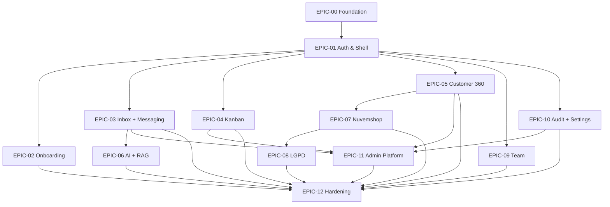

# Master Plan — DeskcommCRM MVP-B Implementation

> **Para Rafael (humano)**: este é o índice de TODOS os epics do MVP-B. Pra rodar autônomo: `clear` o chat, abra novo, e mande `Execute o EPIC-NN-name conforme docs/stories/epics/EPIC-NN-name.md` invocando o skill `epic-executor`.
>
> **Para o epic-executor**: este arquivo é o catálogo. Cada epic tem seu próprio arquivo `.md` em `docs/stories/epics/EPIC-NN-name.md`. Leia o arquivo do epic alvo antes de iniciar Phase 0.

## 1. Princípios de execução

1. **Ordem de execução respeita dependências** (vide grafo §3). Não rode EPIC-03 antes de EPIC-01 — quebra contracts.
2. **Cada epic produz architecture contracts** (em §4 do epic file) que ficam disponíveis pros próximos.
3. **Cada wave (story) passa pelo gate**: build → QA → fix → regression → checkpoint.
4. **State file persiste** em `.epic-executor/{epic-id}-state.yaml` — permite resume.
5. **Regression cumulativa**: cada wave roda tests de TODAS as waves anteriores do epic + smoke tests dos epics anteriores via API.
6. **Modo A (≤15 stories)** dentro de Claude Code — todos os 13 epics estão dimensionados pra Mode A.

## 2. Catálogo de epics

| # | ID | Nome | Stories | Points | Prioridade | Status | Arquivo |
|---|---|---|---|---|---|---|---|
| 0 | EPIC-00 | Foundation & Tooling | 8 | 21 | P0 | ✅ completed | `EPIC-00-foundation.md` |
| 1 | EPIC-01 | Auth & App Shell | 12 | 38 | P0 | ✅ completed | `EPIC-01-auth-app-shell.md` |
| 2 | EPIC-02 | Tenant Onboarding | 8 | 26 | P0 | ✅ completed (partial: WhatsApp QR build-only) | `EPIC-02-onboarding.md` |
| 3 | EPIC-03 | Inbox + Messaging | 15 | 55 | P0 | ✅ completed (partial: WhatsApp E2E send/receive precisa WAHA com sessão WhatsApp ativa) | `EPIC-03-inbox-messaging.md` |
| 4 | EPIC-04 | Pipeline Kanban | 10 | 34 | P0 | ✅ completed | `EPIC-04-kanban.md` |
| 5 | EPIC-05 | Customer 360 + Contacts | 9 | 28 | P0 | ✅ completed (partial: merge resolve + CPF encryption deferred) | `EPIC-05-customer-360.md` |
| 6 | EPIC-06 | AI Agent + RAG | 12 | 42 | P0 | pending (Phase 3 gated) | `EPIC-06-ai-rag.md` |
| 7 | EPIC-07 | Nuvemshop Integration | 11 | 36 | P0 | ✅ completed (env-empty-ready) | `EPIC-07-nuvemshop.md` |
| 8 | EPIC-08 | LGPD Compliance | 8 | 26 | P0 | pending (Phase 3 gated) | `EPIC-08-lgpd.md` |
| 9 | EPIC-09 | Team & Permissions | 7 | 19 | P0 | ✅ completed (env-empty-ready) | `EPIC-09-team.md` |
| 10 | EPIC-10 | Audit & Settings | 9 | 26 | P0 | ✅ completed (partial: notification_prefs stubbed; sessions/storage/email change deferred) | `EPIC-10-audit-settings.md` |
| 11 | EPIC-11 | Super-Admin Platform | 14 | 48 | P0 | pending (Phase 3 gated) | `EPIC-11-admin-platform.md` |
| 12 | EPIC-12 | Hardening + E2E + Polish | 10 | 31 | P0 | ✅ completed (partial: Lighthouse CI + bundle-analyzer + /app/* E2E deferred) | `EPIC-12-hardening.md` |
| 13 | EPIC-13 | AI Agents Module (MCP + multi-provider) | 12 | 44 | P0 | pending | `EPIC-13-ai-agents-module.md` |

**Totais**: 13 epics · 133 stories · ~430 points

## 3. Grafo de dependências



## 4. Ordem recomendada de execução

### Fase A — Foundation (1 epic, sequencial)
1. **EPIC-00** Foundation & Tooling

### Fase B — Auth & Shell (1 epic, sequencial)
2. **EPIC-01** Auth & App Shell

### Fase C — Core Operations (4 epics, podem ser paralelizados em sessões diferentes)
3. **EPIC-02** Onboarding
4. **EPIC-03** Inbox + Messaging  *(coração do produto — prioridade dentro da fase)*
5. **EPIC-04** Pipeline Kanban
6. **EPIC-05** Customer 360 + Contacts

### Fase D — Differentiators (3 epics, paralelizáveis)
7. **EPIC-06** AI + RAG (depende de E03)
8. **EPIC-07** Nuvemshop (depende de E05)
9. **EPIC-09** Team

### Fase E — Compliance (depende de Nuvemshop)
10. **EPIC-08** LGPD Compliance

### Fase F — Operacional (paralelizável após Fase C)
11. **EPIC-10** Audit & Settings

### Fase G — Admin Platform (depende de E03, E04, E05, E10)
12. **EPIC-11** Super-Admin Platform

### Fase H — Hardening (final)
13. **EPIC-12** Hardening + E2E + Polish

## 5. Como rodar (instruções pro humano)

### Setup inicial (uma vez)
```bash
# Garantir que dev server tá rodando
pnpm dev   # http://localhost:3001

# Garantir que migrations 0001-0007 foram aplicadas no Supabase
# (já estão — vide supabase/migrations/MANIFEST.md)
```

### Pra cada epic (sequencial recomendado)
```
clear                                            # esvazia chat
/skill epic-executor                             # carrega skill
Execute o EPIC-00 conforme docs/stories/epics/EPIC-00-foundation.md
```

O epic-executor vai:
1. Ler o arquivo do epic
2. Apresentar plano de execução (Wave 1, 2, ...)
3. Pedir confirmação 1× (única interação humana)
4. Executar autonomamente: build → QA → fix → regression → checkpoint por wave
5. Reportar progresso ao final + commits feitos

### Resume após pause/escalation
```
Resume o EPIC-XX
```

## 6. Architecture Contracts globais (snapshot)

Contracts que ficam disponíveis após cada epic. Use isto pra raciocinar sobre o que está pronto.

### Após EPIC-00
- `hook.useApiClient` — HTTP wrapper com idempotency-key
- `hook.useRealtimeChannel` — Realtime primitive
- `hook.useTheme` — light/dark/system
- `lib.toast` — sonner wired
- `lib.phosphor` — icons disponíveis
- `infra.tanstack-query` — provider configurado
- `infra.test-runner` — Playwright + Vitest

### Após EPIC-01
- `hook.useAuth`, `hook.useUser`, `hook.usePermission`
- `api.POST /api/v1/auth/login`, `/logout`, `/mfa/*`, `/recovery`
- `middleware.ts` — proteção de rotas autenticadas
- `app/(app)/layout.tsx` — shell com sidebar + topbar + theme toggle
- `ui.<Sidebar>`, `<TopBar>`, `<UserMenu>`, `<TenantSwitcher>`
- `route./login`, `/login/mfa`, `/login/recovery`
- 401 → redirect global

### Após EPIC-02
- `route./onboarding/*` (5 steps)
- `api.POST /api/v1/onboarding/*`
- `tenant.onboarding_state` jsonb populado

### Após EPIC-03
- `route./app/inbox`, `/app/inbox/[id]`
- `api.POST /api/v1/conversations/*`, `/messages/*`
- `realtime.inbox-{org_id}`, `messages-{conv_id}`, `typing-{conv_id}`
- `hook.useConversationsRealtime`, `useMessagesRealtime`, `useSendMessage`, `useClaimConversation`
- `ui.<ConversationList>`, `<ChatThread>`, `<MessageBubble>`, `<Composer>`, `<CRMSidePanel>`
- Atalhos: `j/k/r/e/a/?`

### Após EPIC-04
- `route./app/pipelines/[id]`
- `api.POST /api/v1/leads/:id/move`, `/win`, `/lose`, `/bulk`
- `realtime.kanban-{pipeline_id}`
- `hook.useBoard`, `useMoveCard`, `useBulkAction`
- `ui.<KanbanBoard>`, `<KanbanCard>`, `<StageColumn>`

### Após EPIC-05
- `route./app/contacts`, `/app/contacts/[id]`, `/app/contacts/[id]/timeline`
- `api.POST /api/v1/contacts/*`, `/lgpd/anonymize`
- `hook.useContact`, `useTimeline`, `useAnonymizeContact`
- `ui.<ContactCard>`, `<TimelineView>`, `<MergeQueue>`

### Após EPIC-06
- `route./app/ai/agents`, `/app/ai/knowledge`, `/app/ai/usage`
- `api.POST /api/v1/ai/*`, workers do bot + sentiment + RAG indexer
- `hook.useAgent`, `useKnowledgeSources`, `useAiUsage`
- `worker.ai-response`, `ai-sentiment`, `rag-indexer`
- `event.ai.responded`, `ai.handoff_triggered`, `ai.sentiment_alert`

### Após EPIC-07
- `route./app/integrations/nuvemshop`
- `api.GET/POST /api/v1/integrations/nuvemshop/*` + 8 webhook receivers
- `worker.nuvemshop-sync`, `nuvemshop-webhook-handler`
- Server Action `connectNuvemshop` (R-05)

### Após EPIC-08
- `route./app/lgpd/requests`, `/app/lgpd/requests/[id]`
- `api.POST /api/v1/lgpd/data-request`, `/redact`
- `worker.lgpd-export`, `lgpd-redact`
- 3 webhook receivers Nuvemshop LGPD

### Após EPIC-09
- `route./app/team`, `/app/team/invite`
- `api.POST /api/v1/team/invite`, `/role`, `/revoke`

### Após EPIC-10
- `route./app/audit`, `/app/settings/*`
- `api.GET /api/v1/audit`, `/settings/*`

### Após EPIC-11
- `route./admin/*` (14 rotas)
- `api.GET/POST /api/v1/admin/*`
- `realtime.admin-inbox-{platform_admin_id}`, `tenant-health-{id}`
- Cross-tenant queries com `fn_is_platform_admin()` bypass

### Após EPIC-12
- E2E suite Playwright completa (smoke + golden paths)
- Error boundaries + 404/403/500 pages
- Empty states + loading orchestration
- Performance verificada (Core Web Vitals)
- Sentry capturando errors em prod
- README + onboarding docs polish

## 7. Gestão de bug snowball

Cada wave roda regression suite cumulativo. Se uma wave quebra algo de waves anteriores:
1. Fix loop bounded em 3 tentativas
2. Após 3, escalation halt → Rafael revisa
3. State file `.epic-executor/{epic-id}-state.yaml` permite resume após fix manual

## 8. Anexos

- Template canônico: `docs/stories/epics/TEMPLATE.md`
- Reconciliation log: `docs/specs/RECONCILIATION-LOG.md`
- Spec 09 (integration contract): `docs/specs/09-spec-frontend-backend-integration.md`
- Screen inventory: `docs/design-system/screen-flow/03-screen-inventory.md`
- Design system: `docs/design-system/`
